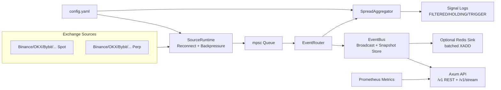

# MarketBridge

Independent Rust data-source bridge for exchange, options, prediction-market,
DeFi, macro, aggregate, and sentiment data. MarketBridge normalizes public data,
caches fresh state, marks stale records, and exposes one stable API surface for
downstream research systems.

Current version: `v0.0.1`


## Table of Contents

- [Why This Project](#why-this-project)
- [Tool Positioning](#tool-positioning)
- [Architecture Contract](#architecture-contract)
- [Tech Stack](#tech-stack)
- [Architecture](#architecture)
- [Runtime Pipeline](#runtime-pipeline)
- [Quick Start](#quick-start)
- [Use Downloaded Binaries](#use-downloaded-binaries)
- [Release Builds](#release-builds)
- [Configuration](#configuration)
- [Implemented Data Plane](#implemented-data-plane)
- [Strategy Readiness Matrix](#strategy-readiness-matrix)
- [API Overview](#api-overview)
- [API Details](#api-details)
- [Connection Model Matrix](#connection-model-matrix)
- [Bring-Up Guide](#bring-up-guide)
- [Testing](#testing)
- [Extend New Exchange](#extend-new-exchange)

## Why This Project

`MarketBridge` solves three hard problems for quant research teams:

- Unified market model across multiple exchanges and both `spot` / `perp`
- Unified API layer (`REST + WebSocket + Redis`) for downstream strategy systems
- Data quality visibility (funding coverage, stale ratio, latency percentiles, health status, alerts)

## Tool Positioning

MarketBridge is a data-plane tool, not a trading bot.

It owns:

- public market-data collection from CEX, DeFi, options, Polymarket, macro, aggregate, and sentiment sources
- normalization into source-agnostic REST/WebSocket APIs
- latest-state caches, freshness flags, source health, and optional Redis Stream persistence
- operational spread signals used as data sanity checks

It does not own:

- factor approval or alpha research decisions
- paper/live PnL attribution
- wallet signing or authenticated order placement
- Polymarket order submit/cancel/replace

Downstream systems such as `PolyAlpha` should call MarketBridge for data, then
run strategy logic, factor validation, paper execution, and live execution in
their own layer.

## Architecture Contract

MarketBridge is being standardized around a source-agnostic data envelope:

```text
connector source -> domain payload -> DataEnvelope -> cache/stream/API
```

The long-term architecture and `/v1` API contract are maintained in
[docs/architecture.md](docs/architecture.md). Current endpoints remain supported
while existing exchange, Deribit, and Polymarket data is migrated into the new
domain model.

## Tech Stack

- Language: `Rust 2024`
- Runtime: `Tokio`
- HTTP/WS API: `Axum`
- WS clients: `tokio-tungstenite`
- Serialization: `serde`, `serde_json`, `serde_yaml`
- Metrics: `prometheus`
- Stream sink: `redis` (`XADD`)
- Logging: `tracing`, `tracing-subscriber`

## Architecture



## Runtime Pipeline

1. Exchange adapters subscribe to public market WS channels.
2. `SourceRuntime` supervises source tasks and reconnects with backoff.
3. `EventRouter` fans data to both `EventBus` and `SpreadAggregator`.
4. `EventBus` maintains ArcSwap latest snapshots and per-domain broadcast streams.
5. `SpreadAggregator` computes cross-exchange opportunity signals with fee/slippage logic.
6. API/WebSocket/optional Redis expose normalized data to quant consumers.

## Quick Start

### 1) Build From Source

Requirements:

- Rust stable toolchain
- Linux, macOS, or Windows
- Optional: Redis if `runtime.redis_url` is configured

```bash
cargo build --release
```

The binary is created at:

```text
target/release/market-bridge
```

On Windows:

```text
target\release\market-bridge.exe
```

### 2) Run From Source

```bash
MARKETBRIDGE_CONFIG=./config.yaml cargo run
```

Use full-exchange sample:

```bash
MARKETBRIDGE_CONFIG=./config.all-exchanges.example.yaml cargo run
```

Or run the built binary directly:

```bash
MARKETBRIDGE_CONFIG=./config.yaml ./target/release/market-bridge
```

### 3) Smoke Check

```bash
curl -s http://127.0.0.1:8080/health
```

### 4) First Data Checks

```bash
curl -s "http://127.0.0.1:8080/v1/catalog/sources" | jq
curl -s "http://127.0.0.1:8080/snapshot?symbol=BTCUSDT" | jq
curl -s "http://127.0.0.1:8080/funding?symbols=BTCUSDT" | jq
curl -s "http://127.0.0.1:8080/coverage?market=perp&symbols=BTCUSDT" | jq
```

## Use Downloaded Binaries

GitHub Actions builds release packages for:

- `linux-x86_64`
- `macos-x86_64`
- `macos-aarch64`
- `windows-x86_64`

Each package contains:

- `market-bridge` or `market-bridge.exe`
- `README.md`
- `config.yaml`
- `config.min.yaml`
- `config.all-exchanges.example.yaml`
- `docs/`
- `VERSION`

Linux/macOS:

```bash
tar -xzf market-bridge-v0.0.1-linux-x86_64.tar.gz
cd market-bridge-v0.0.1-linux-x86_64
chmod +x ./market-bridge
MARKETBRIDGE_CONFIG=./config.yaml ./market-bridge
```

macOS may require allowing the downloaded binary:

```bash
xattr -d com.apple.quarantine ./market-bridge 2>/dev/null || true
```

Windows PowerShell:

```powershell
Expand-Archive .\market-bridge-v0.0.1-windows-x86_64.zip
cd .\market-bridge-v0.0.1-windows-x86_64\market-bridge-v0.0.1-windows-x86_64
$env:MARKETBRIDGE_CONFIG = ".\config.yaml"
.\market-bridge.exe
```

After startup, open another terminal and check:

```bash
curl -s http://127.0.0.1:8080/health
curl -s "http://127.0.0.1:8080/v1/catalog/sources" | jq
```

If you use keyed sources, set the relevant environment variables before
starting the binary:

```bash
export COINGLASS_API_KEY="..."
export COINMARKETCAP_API_KEY="..."
export FRED_API_KEY="..."
export CRYPTOPANIC_API_KEY="..."
export SANTIMENT_API_KEY="..."
export LUNARCRUSH_API_KEY="..."
```

`GET /v1/catalog/sources` reports runtime status:

- `enabled`: source is enabled and has required key material if needed
- `available`: connector exists but is disabled in config
- `enabled_missing_api_key`: source is enabled but required API key is absent

## Release Builds

CI has two workflows:

- `.github/workflows/ci.yml`: runs `cargo fmt`, `cargo clippy`, and tests on pull requests and pushes.
- `.github/workflows/release.yml`: builds cross-platform release packages and uploads artifacts.

Automatic package builds run on pushes to `main` or `master`, tag pushes like
`v0.0.1`, and manual `workflow_dispatch`.

To publish `v0.0.1`:

```bash
git tag v0.0.1
git push origin v0.0.1
```

The release workflow builds:

```text
market-bridge-v0.0.1-linux-x86_64.tar.gz
market-bridge-v0.0.1-macos-x86_64.tar.gz
market-bridge-v0.0.1-macos-aarch64.tar.gz
market-bridge-v0.0.1-windows-x86_64.zip
```

For normal branch pushes, download the packages from the workflow run
artifacts. For tag pushes, the same packages are also attached to the GitHub
Release.

## Configuration

Default file: `config.yaml`

- `runtime.queue_capacity`: source->router channel capacity
- `runtime.broadcast_capacity`: per-domain websocket/redis broadcast buffer
- `runtime.backpressure`: `block` or `drop_newest`
- `runtime.report_interval_ms`: signal report interval
- `runtime.stale_ttl_ms`: stale threshold
- `runtime.api_addr`: API bind address
- `runtime.redis_url`: optional Redis sink
- `runtime.redis_stream_prefix`: Redis Stream prefix when Redis is enabled
- `strategy.*`: min profit, hold, slippage model, and `fee_mode`
  (`taker`, `maker`, `maker_buy_taker_sell`, `taker_buy_maker_sell`)
- `symbols`: global spot symbols
- `perp_symbols`: global perp symbols
- `exchanges.<name>.enabled`: source switch
- `exchanges.<name>.symbols/perp_symbols`: per-exchange override
- `exchanges.<name>.fee`: fixed/tiered fee model
- `defi.<source>.enabled`: DeFi quote/pool source switch
- `defi.<source>.pairs` / `defi.uniswap_v3.pools`: configured DEX pairs and pools
- `tradfi.<source>.enabled`: DXY, VIX, and US10Y reference source switch
- `tradfi.us10y.api_key` or `FRED_API_KEY`: FRED API credential for US10Y
- `aggregates.<source>.enabled`: CoinGecko, CoinMarketCap, and CoinGlass source switch
- `sentiment.<source>.enabled`: Fear & Greed, CryptoPanic, Santiment, and LunarCrush source switch
- `*_API_KEY` env vars: optional or required keys for paid/free external APIs

## Implemented Data Plane

This service is the unified data plane for downstream strategy engines such as
`PolyAlpha`. Strategy logic, factor validation, paper execution, and live order
management should stay outside this repo.

### Exchange Data

| Capability | Status | Interface | Notes |
|---|---:|---|---|
| Spot BBO | Implemented | `GET /snapshot`, `WS /ws/ticks` | Normalized `bid`, `ask`, `symbol`, `exchange`, `market=spot`. |
| Perp BBO | Implemented | `GET /snapshot`, `WS /ws/ticks` | Normalized `market=perp`; symbol mapping differs by venue internally. |
| Perp mark/funding | Implemented where venue provides it | `GET /funding`, `GET /coverage` | Coverage depends on exchange adapter support and live venue payloads. |
| Multi-exchange quality | Implemented | `GET /coverage` | Stale ratio, latency percentiles, funding coverage, alerts. |
| Redis stream sink | Implemented optional | `runtime.redis_url` | Emits normalized ticks to Redis streams when configured. |

### Option / IV Data

| Capability | Status | Interface | Notes |
|---|---:|---|---|
| Deribit option summaries | Implemented | `GET /options/deribit/summary?currency=BTC` | Direct REST fetch. Returns strike, expiry, bid/ask, mark price, `mark_iv`, underlying price. |
| Unified option chain cache | Implemented | `GET /v1/options/chains?venue=deribit&currency=BTC` | Background REST cache for Deribit, OKX, Bybit, and Binance option chains with `received_at_ms` and `stale`. |
| OKX option summaries | Implemented | `GET /v1/options/chains?venue=okx&currency=BTC` | Public `opt-summary`; includes strike, expiry, IV-style fields when venue returns them. |
| Bybit option tickers | Implemented | `GET /v1/options/chains?venue=bybit&currency=BTC` | Public option tickers; includes bid/ask, mark, mark IV, underlying price, open interest. |
| Binance option tickers | Implemented | `GET /v1/options/chains?venue=binance&currency=BTC` | Public European option ticker plus optional mark data; open interest is not in this public ticker payload. |
| Deribit websocket IV | Not implemented | N/A | REST cache is enough for first paper loop; websocket IV cache is future work if REST freshness is not enough. |

### Polymarket Data

| Capability | Status | Interface | Notes |
|---|---:|---|---|
| Active BTC/ETH binary market discovery | Implemented first version | `GET /polymarket/crypto-markets` | Parses `base_asset`, strike, direction, rule type, expiry, Yes/No token ids from Gamma. |
| Single outcome CLOB book | Implemented | `GET /polymarket/book?token_id=...` | Returns full book plus best bid/ask, spread, bid/ask depth. |
| Batch outcome CLOB books | Implemented | `GET /polymarket/books?token_ids=...` | Useful for Yes/No pair checks. |
| Crypto markets plus books | Implemented | `GET /polymarket/crypto-books` | Convenience endpoint for strategy engines. |
| Polymarket CLOB websocket cache | Implemented first version | `GET /polymarket/live-books`, `GET /polymarket/live-crypto-books` | Seeds from REST snapshots, subscribes public CLOB websocket updates, and exposes `stale` for strategy-side freshness gates. |
| Polymarket official SDK/CLI integration | Not implemented | N/A | Current implementation uses public REST endpoints. SDK/CLI integration is future work for authenticated execution and schema safety. |
| Live order placement / cancel / replace | Not implemented | N/A | Execution belongs in a later trading/execution layer, not in this data-plane pass. |

### DeFi / On-chain Price Data

| Capability | Status | Interface | Notes |
|---|---:|---|---|
| Jupiter quotes | Implemented | `GET /v1/market/quotes?exchanges=jupiter` | Polls public Jupiter quote REST and emits normalized `market_quote` ticks. |
| Raydium prices | Implemented | `GET /v1/market/quotes?exchanges=raydium` | Polls Raydium public price map and computes configured pair ratios. |
| Uniswap V3 pool prices | Implemented | `GET /v1/market/quotes?exchanges=uniswap_v3` | Polls configured V3 pools from a GraphQL subgraph. This is pool price, not routed execution. |
| ParaSwap quotes | Implemented | `GET /v1/market/quotes?exchanges=paraswap` | Polls public `/prices` route and emits executable quote-derived prices. |
| 1inch quotes | Implemented configurable | `GET /v1/market/quotes?exchanges=oneinch` | Uses configurable legacy public base URL; newer 1inch gateways may require replacing `base_url`. |

### Traditional Finance Reference Data

| Capability | Status | Interface | Notes |
|---|---:|---|---|
| DXY | Implemented | `GET /v1/market/quotes?exchanges=dxy` | Yahoo Finance chart API, normalized as `symbol=DXY`. Useful as USD strength proxy. |
| VIX | Implemented | `GET /v1/market/quotes?exchanges=vix` | Yahoo Finance chart API, normalized as `symbol=VIX`. Useful as risk/fear proxy. |
| US10Y | Implemented | `GET /v1/market/quotes?exchanges=us10y` | FRED `DGS10`; requires `FRED_API_KEY` or `tradfi.us10y.api_key`. |

### Aggregate / Sentiment Data

| Capability | Status | Interface | Notes |
|---|---:|---|---|
| CoinGecko prices | Implemented | `GET /v1/market/quotes?exchanges=coingecko` | Public simple price API; optional `COINGECKO_API_KEY`. |
| CoinMarketCap prices | Implemented | `GET /v1/market/quotes?exchanges=coinmarketcap` | Requires `COINMARKETCAP_API_KEY`. |
| CoinGlass derivatives aggregate | Implemented | `GET /v1/external/signals?sources=coinglass` | Requires `COINGLASS_API_KEY`; emits funding/OI/liquidation/long-short/basis/options raw aggregate signals. |
| Crypto Fear & Greed | Implemented | `GET /v1/external/signals?sources=fear_greed` | Public Alternative.me index. |
| CryptoPanic news | Implemented | `GET /v1/external/signals?sources=cryptopanic` | Requires `CRYPTOPANIC_API_KEY`; emits scored news items. |
| Santiment metrics | Implemented | `GET /v1/external/signals?sources=santiment` | Requires `SANTIMENT_API_KEY`; GraphQL metrics are config-driven. |
| LunarCrush social metrics | Implemented | `GET /v1/external/signals?sources=lunarcrush` | Requires `LUNARCRUSH_API_KEY`; endpoint/base URL is configurable. |

## Strategy Readiness Matrix

For the crypto binary fair-value / market-making strategy discussed with
`PolyAlpha`, the required inputs are:

| Strategy Input | Needed For | Status in `MarketBridge` | Current Interface |
|---|---|---:|---|
| BTC/ETH spot/perp bid/ask | Underlying price and basis | Implemented | `/snapshot`, `/ws/ticks` |
| DEX quote/pool price | CEX vs DEX basis and route sanity check | Implemented | `/v1/market/quotes?exchanges=jupiter,raydium,uniswap_v3,paraswap,oneinch` |
| Macro reference price | DXY, VIX, US10Y regime filters | Implemented | `/v1/market/quotes?exchanges=dxy,vix,us10y` |
| Aggregate and sentiment signals | Derivatives positioning, news and social regime filters | Implemented | `/v1/external/signals?sources=coinglass,fear_greed,cryptopanic,santiment,lunarcrush` |
| Perp funding | Basis/funding sanity check | Implemented where supported | `/funding` |
| Options IV / option chain | Theoretical digital probability | Implemented multi-venue REST cache | `/v1/options/chains`, `/options/deribit/summary`, `/options/deribit/live-summary` |
| Polymarket market id / strike / expiry | Map event to option inputs | Implemented first version | `/polymarket/crypto-markets` |
| Polymarket Yes/No token ids | Subscribe/query executable prices | Implemented first version | `/polymarket/crypto-markets` |
| Polymarket Yes/No bid/ask/depth | Entry, exit, pair discount, capacity | Implemented REST and live cache first versions | `/polymarket/book`, `/polymarket/books`, `/polymarket/crypto-books`, `/polymarket/live-books`, `/polymarket/live-crypto-books` |
| Stale/latency health | Decision input hygiene | Implemented first version | Exchange ticks expose stale/latency; Polymarket live cache exposes `received_at_ms`, `source_latency_ms`, `source`, and `stale`. |
| Paper decision/PnL loop | Validate signal after 5 minutes | Not implemented here | Belongs in `PolyAlpha`. |
| Live execution | Real order submit/cancel/fills | Not implemented | Future execution layer; not approved for live trading. |

Bottom line: `MarketBridge` now provides a first mature data-source surface for
paper decisions: exchange BBO/funding, DeFi quote and pool prices,
TradFi macro references,
aggregate market data and sentiment signals,
multi-venue option chains, Polymarket
market discovery, REST books, and a live Polymarket CLOB cache. It is still not
an execution engine: authenticated Polymarket order placement/cancel/replace and
strategy PnL validation belong in later layers.

## API Overview

Base URL: `http://127.0.0.1:8080`

| Method | Path | Purpose |
|---|---|---|
| GET | `/` | Service metadata |
| GET | `/health` | Liveness check |
| GET | `/v1/catalog/sources` | Implemented public data sources |
| GET | `/v1/catalog/domains` | Implemented normalized data domains |
| GET | `/v1/catalog/instruments` | Instruments currently visible in live caches |
| GET | `/v1/catalog/health` | Source/domain record counts and freshness status |
| GET | `/v1/market/quotes` | Envelope-based exchange spot/perp quote snapshots |
| GET | `/v1/market/basis` | Spot-perp basis derived from quote snapshots |
| GET | `/v1/market/funding` | Funding-rate snapshots from public perp feeds |
| GET | `/v1/market/open-interest` | Open-interest snapshots from public feeds/REST |
| GET | `/v1/market/liquidations` | Latest public liquidation events |
| GET | `/v1/market/order-books` | Latest L2 book snapshots |
| GET | `/v1/market/trades` | Latest public trade snapshots |
| GET | `/v1/market/klines` | SQLite-backed OHLCV bars from historical REST and realtime tick aggregation |
| GET | `/v1/options/chains` | Envelope-based cached Deribit/OKX/Bybit/Binance option chains |
| GET | `/v1/prediction/books` | Envelope-based cached Polymarket CLOB books |
| GET | `/v1/external/signals` | External aggregate, news, and sentiment signals |
| GET | `/snapshot` | Latest normalized ticks |
| GET | `/funding` | Unified perp funding view |
| GET | `/options/deribit/summary` | Deribit option chain summaries and IV |
| GET | `/options/deribit/live-summary` | Cached Deribit option summaries with freshness fields |
| GET | `/polymarket/crypto-markets` | Parsed Polymarket BTC/ETH binary markets |
| GET | `/polymarket/book` | Polymarket CLOB book summary for one token |
| GET | `/polymarket/books` | Polymarket CLOB book summaries for token ids |
| GET | `/polymarket/midpoints` | Batch public CLOB midpoint prices; no API key |
| GET | `/polymarket/spreads` | Batch public CLOB spreads; no API key |
| GET | `/polymarket/last-trade-prices` | Batch public CLOB last trade prices; no API key |
| GET | `/polymarket/prices` | Batch public CLOB executable BUY/SELL prices; no API key |
| GET | `/polymarket/prices-history` | Single or batch public CLOB price history; no API key |
| GET | `/polymarket/crypto-books` | Parsed crypto markets plus Yes/No CLOB books |
| GET | `/polymarket/live-books` | Cached Polymarket CLOB books seeded by REST and patched by websocket |
| GET | `/polymarket/live-crypto-books` | Parsed crypto markets plus cached Yes/No CLOB books |
| GET | `/coverage` | Data quality dashboard model |
| GET | `/metrics` | Prometheus metrics text |
| WS | `/ws/ticks` | Real-time normalized tick stream |
| WS | `/v1/stream` | Domain-filtered stream for quotes, extended market events, options, and prediction books |

DeFi quote and pool sources are exposed through the same market quote surface:

```bash
curl -s "http://127.0.0.1:8080/v1/market/quotes?exchanges=jupiter,raydium,uniswap_v3,paraswap,oneinch" | jq
```

Traditional finance reference sources use the same quote surface:

```bash
curl -s "http://127.0.0.1:8080/v1/market/quotes?exchanges=dxy,vix,us10y" | jq
```

Aggregate and sentiment sources use the external signal surface:

```bash
curl -s "http://127.0.0.1:8080/v1/external/signals?sources=coinglass,fear_greed,cryptopanic,santiment,lunarcrush" | jq
```

### Exchange Public Data Coverage

| Venue | Funding | Open interest | Liquidations | L2 book | Trades |
|---|---|---|---|---|---|
| Binance | WS `markPrice@1s` | REST poll `openInterest` | WS `forceOrder` | WS `depth20@100ms` | WS `aggTrade` |
| Bybit | WS `tickers` | WS `tickers` | WS `allLiquidation` | WS `orderbook.50` | WS `publicTrade` |
| OKX | WS `funding-rate` | WS `open-interest` | REST poll `liquidation-orders` | WS `books5` | WS `trades` |
| Hyperliquid | WS `activeAssetCtx` | WS `activeAssetCtx` | Not exposed as a stable all-market public channel | WS `l2Book` | WS `trades` |
| dYdX v4 | REST poll `perpetualMarkets` | REST poll `perpetualMarkets` | Not exposed as a stable all-market public channel | WS `v4_orderbook` | WS `v4_trades` |
| Backpack | Product-dependent | Product-dependent | Not exposed as a stable all-market public channel | WS `depth` | WS `trade` |
| MEXC | Perp ticker when field is present | Not yet exposed | Not yet exposed | WS spot/futures depth | WS spot/futures deals |
| BingX | Swap ticker when field is present | Swap ticker when field is present | Not yet exposed | WS `depth20` | WS `trade` |

Other CEX adapters still provide BBO and venue-specific mark/funding fields where
their ticker feed includes them. The new typed feeds are wired first for
Binance, Bybit, and OKX because they cover the highest-volume public derivatives
venues and the exact sources needed for funding/OI/liquidation/depth/trade
research.

The newer venue connectors are public-data only and keyless. Where a venue does
not provide a stable all-market liquidation stream, MarketBridge leaves that
domain empty instead of fabricating a signal.

## API Details

### `GET /`

Returns service info.

Example:

```bash
curl -s http://127.0.0.1:8080/
```

### `GET /health`

Simple liveness endpoint.

Example:

```bash
curl -s http://127.0.0.1:8080/health
```

### `GET /v1/catalog/*`

Catalog endpoints for discovering what MarketBridge can provide right now.

Examples:

```bash
curl -s "http://127.0.0.1:8080/v1/catalog/sources" | jq
curl -s "http://127.0.0.1:8080/v1/catalog/domains" | jq
curl -s "http://127.0.0.1:8080/v1/catalog/instruments" | jq
```

### `GET /v1/market/quotes`

Envelope-based exchange quote snapshots. This is the first `/v1` domain endpoint
and should be preferred by new consumers.

Query params:

- `symbols=BTCUSDT,ETHUSDT`
- `exchanges=okx,bybit,bitget`
- `product_type=spot|perp`
- `include_stale=true|false`, default `false`

Examples:

```bash
curl -s "http://127.0.0.1:8080/v1/market/quotes?symbols=BTCUSDT&product_type=perp" | jq
```

### `GET /v1/market/klines`

SQLite-backed OHLCV bars. Historical REST backfill supports Binance and OKX;
realtime bars are aggregated from live quote ticks and written once per update
batch. Enable it in config:

```yaml
klines:
  enabled: true
  sqlite_path: "data/marketbridge.sqlite"
  intervals: [1m, 5m, 15m, 1h]
  history_limit: 1500
  backfill_on_start: false
  sources: [binance, okx]
```

Query params:

- `exchange=binance|okx|...`
- `market=spot|perp`
- `symbol=BTCUSDT`
- `interval=1m|5m|15m|1h`
- `start_ms`, `end_ms`, optional Unix milliseconds
- `limit`, default `500`, max `5000`

Examples:

```bash
curl -s "http://127.0.0.1:8080/v1/market/klines?exchange=binance&market=perp&symbol=BTCUSDT&interval=1m&limit=100" | jq
```

### `GET /v1/market/basis`

Spot-perp basis computed from current quote snapshots. No new venue data source
is required: MarketBridge pairs `spot` and `perp` quotes from the same exchange
and symbol.

Query params:

- `symbols=BTCUSDT,ETHUSDT`
- `exchanges=binance,okx,bybit`

Example:

```bash
curl -s "http://127.0.0.1:8080/v1/market/basis?symbols=BTCUSDT&exchanges=binance,okx" | jq
```

Key fields:

- `spot_mid`, `perp_mid`
- `basis = perp_mid - spot_mid`
- `basis_bps = basis / spot_mid * 10000`

### `GET /v1/options/chains`

Envelope-based option chain snapshots from the unified option cache.

Query params:

- `venue`, optional, `deribit`, `okx`, `bybit`, or `binance`
- `currency`, optional, e.g. `BTC`
- `option_type`, optional, `call` or `put`
- `strike_min`, `strike_max`, optional numeric filters
- `expiry_after`, `expiry_before`, optional ISO timestamp string filters
- `include_stale=true|false`, default `false`

Example:

```bash
curl -s "http://127.0.0.1:8080/v1/options/chains?venue=bybit&currency=BTC&option_type=call" | jq
```

### `GET /v1/prediction/books`

Envelope-based prediction-market order books from the Polymarket live cache.

Query params:

- `token_ids`, optional comma-separated Polymarket token ids
- `include_stale=true|false`, default `false`

Example:

```bash
curl -s "http://127.0.0.1:8080/v1/prediction/books?token_ids=YES_TOKEN,NO_TOKEN" | jq
```

### `GET /snapshot`

Returns in-memory latest snapshots from `EventBus`.

Query params:

- `symbol` optional, e.g. `BTCUSDT`

Examples:

```bash
curl -s http://127.0.0.1:8080/snapshot | jq
curl -s "http://127.0.0.1:8080/snapshot?symbol=BTCUSDT" | jq
```

Key fields in each item:

- `exchange`, `market`, `symbol`
- `bid`, `ask`, `mark`, `funding`
- `ts`, `source_latency_ms`, `stale`

### `WS /ws/ticks`

Normalized tick stream subscription.

Query params:

- `symbols=BTCUSDT,ETHUSDT`
- `exchanges=okx,bybit`
- `market=spot|perp`

Example:

```bash
wscat -c "ws://127.0.0.1:8080/ws/ticks?market=perp&symbols=BTCUSDT"
```

### `WS /v1/stream`

Domain-filtered websocket stream. It supports live `market_quote`,
`funding`, `open_interest`, `trade`, `liquidation`, `order_book`, and
`external_signal` events, plus cached snapshot streaming for `options_chain`
and `prediction_book`.

Query params:

- `domains=market_quote,funding,open_interest,trade,liquidation,order_book,external_signal,options_chain,prediction_book`
- `symbols=BTCUSDT`
- `exchanges=okx,deribit,polymarket` or external signal source names
- `product_type=spot|perp|option|binary_outcome`
- `include_stale=true|false` default `false`
- `snapshot_interval_ms=1000` for cached domains, clamped to `250..60000`

Example:

```bash
wscat -c "ws://127.0.0.1:8080/v1/stream?domains=market_quote&symbols=BTCUSDT&product_type=perp"
wscat -c "ws://127.0.0.1:8080/v1/stream?domains=funding&symbols=BTCUSDT&exchanges=binance,okx"
wscat -c "ws://127.0.0.1:8080/v1/stream?domains=order_book,trade&symbols=BTCUSDT&product_type=perp"
wscat -c "ws://127.0.0.1:8080/v1/stream?domains=options_chain,prediction_book&include_stale=false"
```

### `GET /funding`

Unified perp funding view by canonical symbol.

Query params:

- `symbols=BTCUSDT,ETHUSDT`
- `exchanges=okx,bybit,bitget`
- `only_with_funding=true|false` default `true`
- `include_stale=true|false` default `false`

Examples:

```bash
curl -s "http://127.0.0.1:8080/funding" | jq
curl -s "http://127.0.0.1:8080/funding?symbols=BTCUSDT&exchanges=okx,bybit,bitget" | jq
```

Response model per symbol:

- `symbol`
- `exchanges_total`, `exchanges_with_funding`
- `min_funding`, `max_funding`, `funding_spread`
- `updated_at`
- `points[]` with `exchange/raw_symbol/funding/mark/stale/source_latency_ms/ts`

### `GET /options/deribit/summary`

Unified Deribit option summary feed for crypto binary-pricing models.

Query params:

- `currency=BTC|ETH`, default `BTC`

Example:

```bash
curl -s "http://127.0.0.1:8080/options/deribit/summary?currency=BTC" | jq
```

Key fields in `summaries[]`:

- `instrument_name`, `option_type`, `strike`, `expiry_time`
- `bid_price`, `ask_price`, `mark_price`, `mark_iv`
- `underlying_price`, `underlying_index`, `open_interest`

### `GET /options/deribit/live-summary`

Cached Deribit option summary feed. This endpoint reads the in-process data
cache instead of hitting Deribit on every strategy decision.

Enable the background cache in config:

```yaml
deribit:
  enabled: true
  base_url: "https://www.deribit.com/api/v2/"
  currencies: [BTC, ETH]
  refresh_secs: 10
  stale_ttl_ms: 30000

okx_options:
  enabled: true
  base_url: "https://www.okx.com/api/v5/"
  currencies: [BTC, ETH]
  refresh_secs: 10

bybit_options:
  enabled: true
  base_url: "https://api.bybit.com/v5/"
  currencies: [BTC, ETH]
  refresh_secs: 10

binance_options:
  enabled: true
  base_url: "https://eapi.binance.com/"
  currencies: [BTC, ETH]
  refresh_secs: 10
```

Query params:

- `currency`, optional, e.g. `BTC`
- `option_type`, optional, `call` or `put`
- `strike_min`, `strike_max`, optional numeric filters
- `expiry_after`, `expiry_before`, optional ISO timestamp string filters
- `include_stale=true|false`, default `false`

Example:

```bash
curl -s "http://127.0.0.1:8080/options/deribit/live-summary?currency=BTC&option_type=call&strike_min=90000&strike_max=120000" | jq
```

Key fields in `summaries[]`:

- `source`: `deribit_rest_cache`
- `received_at_ms`, `stale`
- all direct Deribit summary fields from `/options/deribit/summary`

### `GET /polymarket/crypto-markets`

Parsed active Polymarket BTC/ETH binary markets for downstream strategy engines.

Query params:

- `limit`, default `500`
- `max_offset`, default `5000`
- `gamma_base_url`, default `https://gamma-api.polymarket.com/`

Example:

```bash
curl -s "http://127.0.0.1:8080/polymarket/crypto-markets?limit=500&max_offset=500" | jq
```

Response fields:

- `markets[]`: parsed `base_asset`, `strike`, `direction`, `rule_type`, `expiry_time`, Yes/No token ids
- `clob_asset_ids[]`: token ids that a Polymarket CLOB collector should subscribe to

### `GET /polymarket/book`

Polymarket CLOB book summary for one outcome token.

Query params:

- `token_id` required

Example:

```bash
curl -s "http://127.0.0.1:8080/polymarket/book?token_id=TOKEN_ID" | jq
```

Key fields in `book`:

- `asset_id`, `market`, `timestamp`
- `best_bid`, `best_ask`, `spread`
- `bid_depth`, `ask_depth`
- full raw `book.bids[]` and `book.asks[]`

### `GET /polymarket/books`

Batch Polymarket CLOB book summaries.

Query params:

- `token_ids` comma-separated token ids

Example:

```bash
curl -s "http://127.0.0.1:8080/polymarket/books?token_ids=YES_TOKEN,NO_TOKEN" | jq
```

### `GET /polymarket/midpoints`

Batch wrapper for public Polymarket CLOB `POST /midpoints`.

Query params:

- `token_ids` comma-separated token ids, max 500

### `GET /polymarket/spreads`

Batch wrapper for public Polymarket CLOB `POST /spreads`.

Query params:

- `token_ids` comma-separated token ids, max 500

### `GET /polymarket/last-trade-prices`

Batch wrapper for public Polymarket CLOB `POST /last-trades-prices`.

Query params:

- `token_ids` comma-separated token ids, max 500

### `GET /polymarket/prices`

Batch wrapper for public Polymarket CLOB `POST /prices`.

Query params:

- `token_ids` comma-separated token ids, max 500
- `sides` optional comma-separated sides, `BUY`, `SELL`, or omitted for both

### `GET /polymarket/prices-history`

Wrapper for public Polymarket CLOB `GET /prices-history` and `POST
/batch-prices-history`.

Query params:

- `token_id` for a single token, or `token_ids` comma-separated for batch, max 20
- `start_ts`, `end_ts`, `interval`, `fidelity` optional history controls

Examples:

```bash
curl -s "http://127.0.0.1:8080/polymarket/midpoints?token_ids=YES_TOKEN,NO_TOKEN" | jq
curl -s "http://127.0.0.1:8080/polymarket/prices?token_ids=YES_TOKEN&sides=BUY,SELL" | jq
curl -s "http://127.0.0.1:8080/polymarket/prices-history?token_id=YES_TOKEN&interval=1h&fidelity=1" | jq
```

### `GET /polymarket/crypto-books`

Convenience endpoint for strategy engines: parsed active BTC/ETH binary markets plus the current Yes/No CLOB book summaries.

Query params are the same as `/polymarket/crypto-markets`.

### `GET /polymarket/live-books`

Cached Polymarket CLOB books for outcome token ids. The cache is populated by
REST snapshots first, then patched by public Polymarket CLOB websocket events
when they arrive.

Enable the background cache in config:

```yaml
polymarket:
  enabled: true
  ws_url: "wss://ws-subscriptions-clob.polymarket.com/ws/market"
  gamma_base_url: "https://gamma-api.polymarket.com/"
  limit: 500
  max_offset: 5000
  refresh_secs: 300
  ping_secs: 10
  chunk_size: 500
  stale_ttl_ms: 1500
```

Query params:

- `token_ids` optional comma-separated token ids. If omitted, returns all cached books.

Example:

```bash
curl -s "http://127.0.0.1:8080/polymarket/live-books?token_ids=YES_TOKEN,NO_TOKEN" | jq
```

Key fields in `books[]`:

- `source`: `polymarket_clob_rest` for seed snapshots, `polymarket_clob_ws` for websocket updates
- `last_event_type`: `book`, `best_bid_ask`, or `price_change`
- `best_bid`, `best_ask`, `spread`, `bid_depth`, `ask_depth`
- `received_at_ms`, `source_latency_ms`, `stale`

Decision runners should reject a Polymarket book when `stale=true` or when the
source is not fresh enough for the intended holding period. This is deliberate:
the data plane exposes truth, the strategy layer decides whether to trade.

### `GET /polymarket/live-crypto-books`

Parsed active BTC/ETH binary markets plus cached Yes/No books from the live
Polymarket cache.

Query params are the same as `/polymarket/crypto-markets`.

Example:

```bash
curl -s "http://127.0.0.1:8080/polymarket/live-crypto-books?limit=500&max_offset=500" | jq
```

### `GET /coverage`

Dashboard-grade quality model with global summary, market summary, exchange summary, symbol detail, and alerts.

Query params:

- `symbols=BTCUSDT,ETHUSDT`
- `exchanges=okx,bybit,bitget,binance`
- `market=spot|perp`
- `include_stale=true|false` default `true`
- `only_with_funding=true|false` default `false`

Examples:

```bash
curl -s "http://127.0.0.1:8080/coverage" | jq
curl -s "http://127.0.0.1:8080/coverage?market=perp&symbols=BTCUSDT" | jq
curl -s "http://127.0.0.1:8080/coverage?market=perp&exchanges=okx,bybit,bitget" | jq
```

Top-level fields:

- `generated_at`
- `query` normalized effective filters
- `summary` global KPIs
- `summary.markets[]` market-level KPIs
- `exchange_summaries[]` per-exchange health profile
- `alerts[]` global/exchange/symbol alerts
- `symbols[]` symbol-level details

`summary` KPIs include:

- `total_symbols`, `total_points`
- `healthy_symbols`, `warning_symbols`, `critical_symbols`
- `stale_ratio`, `funding_coverage_ratio`
- `online_exchange_count`, `expected_exchange_count`, `exchange_online_ratio`
- `latency_ms_p50`, `latency_ms_p95`

`symbols[]` fields include:

- `symbol`, `market`, `health_status`, `alerts[]`
- `exchanges_total`, `exchanges_with_funding`, `funding_coverage_ratio`
- `exchanges_stale`, `stale_ratio`
- `latency_ms_min`, `latency_ms_p50`, `latency_ms_avg`, `latency_ms_p95`, `latency_ms_max`
- `points[]` per-exchange latest data

### `GET /metrics`

Prometheus text metrics endpoint.

Example:

```bash
curl -s http://127.0.0.1:8080/metrics
```

Current metrics include:

- `ticks_ingested_total`
- `bus_publish_total`
- `ws_subscribers`
- `redis_xadd_total`
- `ticks_dropped_total`

## Connection Model Matrix

| Exchange | Spot model | Perp model (this project) | Notes |
|---|---|---|---|
| Binance | Single WS combined stream | Single WS combined stream | Spot `stream.binance.com`, perp `fstream.binance.com` |
| OKX | Single WS multi-subscribe | Single WS multi-subscribe | `tickers` + `-SWAP` mapping |
| Bybit | Single WS multi-subscribe | Single WS multi-subscribe | v5 `spot` / `linear` |
| Bitget | Single WS multi-subscribe | Single WS multi-subscribe | v2 public WS |
| KuCoin | Single WS multi-topic | Single WS multi-topic | tokenized endpoint |
| Gate | Single WS multi-symbol | Single WS multi-symbol | separate spot/perp WS domains |
| Kraken | Single WS multi-symbol | Single WS multi-symbol | perp symbol naming is venue-specific |
| HTX | Single WS multi-channel | Single WS multi-channel | gzip payload |
| Bitfinex | Single WS multi-channel | Single WS multi-channel | `chanId -> symbol` map |
| Coinbase | Single WS multi-product | Not implemented | spot only in this project |

Perp adapters enabled in code:

- `okx_perp`, `bybit_perp`, `bitget_perp`, `binance_perp`, `kucoin_perp`, `gate_perp`, `kraken_perp`, `htx_perp`, `bitfinex_perp`

Perp symbol conversion defaults:

- Binance / Bybit / Bitget: `BTCUSDT`
- OKX / HTX: `BTC-USDT-SWAP` (OKX) / `BTC-USDT` (HTX)
- KuCoin Perp: `BTCUSDTM`
- Gate Perp: `BTC_USDT`
- Bitfinex Perp: `tBTCF0:USDTF0`
- Kraken Perp: pass-through (configure exact venue symbol)

## Bring-Up Guide

1. Start with one spot exchange (`binance` or `okx`) and verify steady snapshot updates.
2. Enable one perp exchange and verify `market=perp` plus `mark/funding` fields.
3. Enable two perp exchanges and verify `/funding` spread and `/coverage` health split.
4. Expand to full config and monitor `/coverage` + `/metrics` continuously.

Practical notes:

- If an exchange is region-restricted, keep `enabled: false`.
- Kraken perp symbol naming is pass-through in this repo.
- Coinbase is spot-only in this repo.

## Testing

Run checks:

```bash
cargo fmt
cargo check
cargo test
```

## Extend New Exchange

1. Add `src/connectors/cex/<name>.rs`
2. Implement `ExchangeSource`
3. Convert payloads into `MarketTick` (`Spot` or `Perp`)
4. Register source in `src/connectors/cex/registry.rs`
