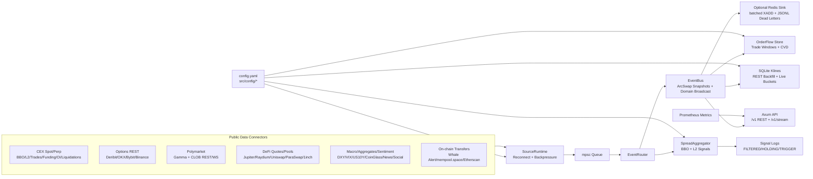

# MarketBridge

Independent Rust data-source bridge for exchange, options, prediction-market,
DeFi, macro, aggregate, and sentiment data. MarketBridge normalizes public data,
caches fresh state, marks stale records, and exposes one stable API surface for
downstream research systems.

Current version: `v0.0.3`

[中文文档](README.zh-CN.md)


## Table of Contents

- [Why This Project](#why-this-project)
- [Tool Positioning](#tool-positioning)
- [Architecture Contract](#architecture-contract)
- [Tech Stack](#tech-stack)
- [Architecture](#architecture)
- [Runtime Pipeline](#runtime-pipeline)
- [Quick Start](#quick-start)
- [Use Downloaded Binaries](#use-downloaded-binaries)
- [Release Builds](#release-builds)
- [Configuration](#configuration)
- [Implemented Data Plane](#implemented-data-plane)
- [Data Sources and API Keys](#data-sources-and-api-keys)
- [Strategy Readiness Matrix](#strategy-readiness-matrix)
- [API Overview](#api-overview)
- [API Details](#api-details)
- [Connection Model Matrix](#connection-model-matrix)
- [Bring-Up Guide](#bring-up-guide)
- [Testing](#testing)
- [Extend New Exchange](#extend-new-exchange)

## Why This Project

`MarketBridge` solves three hard problems for quant research teams:

- Unified market model across multiple exchanges and both `spot` / `perp`
- Unified API layer (`REST + WebSocket + Redis`) for downstream strategy systems
- Data quality visibility (funding coverage, stale ratio, latency percentiles, health status, alerts)

## Tool Positioning

MarketBridge is a data-plane tool, not a trading bot.

It owns:

- public market-data collection from CEX, DeFi, options, Polymarket, macro, aggregate, and sentiment sources
- normalization into source-agnostic REST/WebSocket APIs
- latest-state caches, freshness flags, source health, and optional Redis Stream persistence
- operational spread signals used as data sanity checks

It does not own:

- factor approval or alpha research decisions
- paper/live PnL attribution
- wallet signing or authenticated order placement
- Polymarket order submit/cancel/replace

Downstream systems such as `PolyAlpha` should call MarketBridge for data, then
run strategy logic, factor validation, paper execution, and live execution in
their own layer.

## Architecture Contract

MarketBridge is being standardized around a source-agnostic data envelope:

```text
connector source -> domain payload -> DataEnvelope -> cache/stream/API
```

The long-term architecture and `/v1` API contract are maintained in
[docs/architecture.md](docs/architecture.md). Current endpoints remain supported
while existing exchange, Deribit, and Polymarket data is migrated into the new
domain model.

The consumer-facing endpoint map is maintained in
[docs/data_interfaces.md](docs/data_interfaces.md).

The current performance review and next optimization roadmap are maintained in
[docs/performance_review.md](docs/performance_review.md).

The external source expansion inventory is tracked in
[docs/source_expansion_inventory.md](docs/source_expansion_inventory.md). It uses
third-party projects only as reference lists; MarketBridge does not call, embed,
bridge, or depend on them at runtime. Use
[docs/feature_inventory.md](docs/feature_inventory.md) for runtime coverage.

## Tech Stack

- Language: `Rust 2024`
- Runtime: `Tokio`
- HTTP/WS API: `Axum`
- WS clients: `tokio-tungstenite`
- Serialization: `serde`, `serde_json`, `serde_yaml`
- Metrics: `prometheus`
- Stream sink: `redis` (`XADD`)
- Logging: `tracing`, `tracing-subscriber`

## Architecture



## Runtime Pipeline

1. Public connectors collect CEX, options, prediction-market, DeFi, macro,
   sentiment, aggregate, and on-chain data.
2. `SourceRuntime` supervises source tasks and reconnects with backoff.
3. `EventRouter` fans data to both `EventBus` and `SpreadAggregator`.
4. `EventBus` maintains DashMap latest snapshots and per-domain broadcast streams.
5. `OrderFlowStore` and `KlineStore` derive reusable market features from live
   trade/quote events.
6. `SpreadAggregator` computes cross-exchange opportunity signals with fee/slippage logic.
7. API/WebSocket/optional Redis expose normalized data to quant consumers.

The layers deliberately separate responsibilities:

| Layer | Owns | Does not own |
|---|---|---|
| Connector | Venue protocol, REST polling, websocket subscriptions, symbol conversion, parser tests | Cross-source strategy rules |
| Domain | Normalized `DataEnvelope`, cache keys, freshness, stale flags, query filters | Venue-specific retry logic |
| Runtime | Source supervision, reconnect backoff, backpressure, broadcast fanout | Data interpretation |
| Derived stores | Basis, order flow, klines, health summaries | Alpha approval or execution |
| API | Stable REST/WebSocket/Redis delivery | Wallet signing or order routing |

### Update Frequency Model

MarketBridge does not downsample websocket feeds before cache/stream delivery.
WebSocket sources are processed as venue messages arrive. Polling sources use
configurable or connector-level intervals so rate-limited public APIs are not
abused.

| Data family | Default behavior |
|---|---|
| Core CEX websocket quotes/trades/books | Event-driven, source-push speed |
| Binance depth | `depth20@100ms` stream |
| Binance mark/funding | `markPrice@1s` stream |
| REST-only CEX adapters | Usually 5 second polling |
| Options chains | `refresh_secs`, default 10 seconds |
| Polymarket CLOB books | REST seed plus websocket patch stream |
| Polymarket Gamma market discovery | `refresh_secs`, default 300 seconds |
| DeFi quote/pool sources | `poll_secs`, default 10 seconds |
| On-chain transfer sources | `poll_secs`, default 60 seconds |
| Macro/sentiment/aggregate sources | Source-specific `poll_secs`, usually 60 seconds or slower |
| Spread report logs | `runtime.report_interval_ms`, default 1000 ms, minimum 100 ms |
| `/v1/stream` snapshot domains | `snapshot_interval_ms`, default 1000 ms, minimum 250 ms |

If the goal is maximum raw ingestion, prefer websocket-capable CEX sources,
raise `runtime.queue_capacity`, keep `runtime.backpressure: drop_newest` for
low latency, and only lower REST polling intervals after checking venue rate
limits.

## Quick Start

### 1) Build From Source

Requirements:

- Rust stable toolchain
- Linux, macOS, or Windows
- Optional: Redis if `runtime.redis_url` is configured

```bash
cargo build --release
```

The binary is created at:

```text
target/release/market-bridge
```

On Windows:

```text
target\release\market-bridge.exe
```

### 2) Run From Source

```bash
MARKETBRIDGE_CONFIG=./config.yaml cargo run
```

Use full-exchange sample:

```bash
MARKETBRIDGE_CONFIG=./config.all-exchanges.example.yaml cargo run
```

Or run the built binary directly:

```bash
MARKETBRIDGE_CONFIG=./config.yaml ./target/release/market-bridge
```

### 3) Smoke Check

```bash
curl -s http://127.0.0.1:8080/health
```

### 4) First Data Checks

```bash
curl -s "http://127.0.0.1:8080/v1/catalog/sources" | jq
curl -s "http://127.0.0.1:8080/snapshot?symbol=BTCUSDT" | jq
curl -s "http://127.0.0.1:8080/funding?symbols=BTCUSDT" | jq
curl -s "http://127.0.0.1:8080/coverage?market=perp&symbols=BTCUSDT" | jq
```

### 5) Stream Live Data

```bash
npx wscat -c "ws://127.0.0.1:8080/v1/stream?domains=market_quote,trade,order_book&symbols=BTCUSDT&product_type=perp&snapshot_interval_ms=250"
```

### 6) Feed PolyAlpha

Keep MarketBridge running, then fetch a long-table context file from PolyAlpha:

```bash
cd /path/to/PolyAlpha
PYTHONPATH=profiler .venv/bin/python profiler/profile_wallets.py fetch-marketbridge-context \
  --base-url http://127.0.0.1:8080 \
  --symbol BTCUSDT \
  --symbol ETHUSDT \
  --exchange binance \
  --exchange okx \
  --market perp \
  --include-snapshots \
  --out data/profiler/marketbridge_context.csv
```

## Use Downloaded Binaries

GitHub Actions builds release packages for:

| Package suffix | Download file | Use when |
|---|---|---|
| `linux-x86_64` | `market-bridge-v0.0.3-linux-x86_64.tar.gz` | Normal 64-bit Intel/AMD Linux server or desktop. |
| `linux-i686` | `market-bridge-v0.0.3-linux-i686.tar.gz` | 32-bit x86 Linux environments only. Most users should not pick this. |
| `macos-x86_64` | `market-bridge-v0.0.3-macos-x86_64.tar.gz` | Intel Mac. |
| `macos-aarch64` | `market-bridge-v0.0.3-macos-aarch64.tar.gz` | Apple Silicon Mac, M1/M2/M3/M4. |
| `windows-x86_64` | `market-bridge-v0.0.3-windows-x86_64.zip` | 64-bit Windows. |

Each package contains:

- `market-bridge` or `market-bridge.exe`
- `README.md`
- `config.yaml`
- `config.min.yaml`
- `config.all-exchanges.example.yaml`
- `docs/`
- `VERSION`

Linux/macOS usage:

```bash
tar -xzf market-bridge-v0.0.3-linux-x86_64.tar.gz   # replace suffix for your platform
cd market-bridge-v0.0.3-linux-x86_64
chmod +x ./market-bridge
MARKETBRIDGE_CONFIG=./config.yaml ./market-bridge
```

macOS may require allowing the downloaded binary:

```bash
xattr -d com.apple.quarantine ./market-bridge 2>/dev/null || true
```

Windows PowerShell:

```powershell
Expand-Archive .\market-bridge-v0.0.3-windows-x86_64.zip
cd .\market-bridge-v0.0.3-windows-x86_64\market-bridge-v0.0.3-windows-x86_64
$env:MARKETBRIDGE_CONFIG = ".\config.yaml"
.\market-bridge.exe
```

After startup, open another terminal and check:

```bash
curl -s http://127.0.0.1:8080/health
curl -s "http://127.0.0.1:8080/v1/catalog/sources" | jq
curl -s "http://127.0.0.1:8080/v1/market/quotes?symbols=BTCUSDT" | jq
```

If you use keyed sources, set the relevant environment variables before
starting the binary:

```bash
export COINGLASS_API_KEY="..."
export COINMARKETCAP_API_KEY="..."
export FRED_API_KEY="..."
export CRYPTOPANIC_API_KEY="..."
export SANTIMENT_API_KEY="..."
export LUNARCRUSH_API_KEY="..."
```

`GET /v1/catalog/sources` reports runtime status:

- `enabled`: source is enabled and has required key material if needed
- `available`: connector exists but is disabled in config
- `enabled_missing_api_key`: source is enabled but required API key is absent

The release binary reads the same configuration schema as `cargo run`.
Choose one of the included configs:

- `config.min.yaml`: smallest smoke-test config.
- `config.yaml`: default practical config for local research.
- `config.all-exchanges.example.yaml`: broad connector example; edit before
  running if you do not want every public source enabled.

## Release Builds

CI has two workflows:

- `.github/workflows/ci.yml`: runs `cargo fmt`, `cargo clippy`, and tests on pull requests and pushes.
- `.github/workflows/release.yml`: builds cross-platform release packages and uploads artifacts.

Automatic package builds run on pushes to `main` or `master`, tag pushes like
`v0.0.3`, and manual `workflow_dispatch`.

To publish `v0.0.3`:

```bash
git tag -f v0.0.3 HEAD
git push origin master
git push --force origin refs/tags/v0.0.3
```

For a first-time tag where no previous `v0.0.3` exists, this also works:

```bash
git tag v0.0.3
git push origin v0.0.3
```

The release workflow builds:

```text
market-bridge-v0.0.3-linux-x86_64.tar.gz
market-bridge-v0.0.3-linux-i686.tar.gz
market-bridge-v0.0.3-macos-x86_64.tar.gz
market-bridge-v0.0.3-macos-aarch64.tar.gz
market-bridge-v0.0.3-windows-x86_64.zip
```

For normal branch pushes, download the packages from the workflow run
artifacts. For tag pushes, the same packages are also attached to the GitHub
Release.

When re-cutting `v0.0.3`, confirm the GitHub Release assets were produced from
the latest tag commit, not an older branch artifact.

## Configuration

Default file: `config.yaml`

- `runtime.queue_capacity`: source->router channel capacity
- `runtime.router_publish_queue_capacity`: router->bus worker channel capacity; `0` or omitted reuses `queue_capacity`
- `runtime.broadcast_capacity`: per-domain websocket/redis broadcast buffer
- `runtime.backpressure`: `block` or `drop_newest`
- `runtime.report_interval_ms`: signal report interval
- `runtime.stale_ttl_ms`: stale threshold
- `runtime.api_addr`: API bind address
- `runtime.redis_url`: optional Redis sink
- `runtime.redis_stream_prefix`: Redis Stream prefix when Redis is enabled
- `runtime.redis_dead_letter_path`: JSONL dead-letter path for Redis batches that still fail after retries
- `runtime.order_flow_large_trade_notional_usdt`: large-trade threshold for `/v1/market/order-flow`
- `runtime.ws_send_timeout_ms`: websocket send timeout before disconnecting slow clients
- `strategy.*`: min profit, hold, slippage model, and `fee_mode`
  (`taker`, `maker`, `maker_buy_taker_sell`, `taker_buy_maker_sell`)
- `strategy.book_signal_notional_usdt`: L2 book notional used by book-level spread signals
- `strategy.fallback_maker_fee_bps` / `strategy.fallback_taker_fee_bps`: conservative fee assumptions for sources without explicit exchange fee config
- `symbols`: global spot symbols
- `perp_symbols`: global perp symbols
- `exchanges.<name>.enabled`: source switch
- `exchanges.<name>.symbols/perp_symbols`: per-exchange override
- `exchanges.<name>.fee`: fixed/tiered fee model
- `defi.<source>.enabled`: DeFi quote/pool source switch
- `defi.<source>.pairs` / `defi.uniswap_v3.pools`: configured DEX pairs and pools
- `tradfi.<source>.enabled`: DXY, VIX, and US10Y reference source switch
- `tradfi.us10y.api_key` or `FRED_API_KEY`: FRED API credential for US10Y
- `aggregates.<source>.enabled`: CoinGecko, CoinMarketCap, and CoinGlass source switch
- `sentiment.<source>.enabled`: Fear & Greed, CryptoPanic, Santiment, and LunarCrush source switch
- `*_API_KEY` env vars: optional or required keys for paid/free external APIs

## Implemented Data Plane

This service is the unified data plane for downstream strategy engines such as
`PolyAlpha`. Strategy logic, factor validation, paper execution, and live order
management should stay outside this repo.

The complete source-by-source inventory, API-key requirements, and usage
examples are maintained in [docs/data_sources.md](docs/data_sources.md). The
tables below are a shorter runtime summary.

### Data and Interface Matrix

| Data family | What you get | Primary interface | Stream support | Default freshness model | Key required |
|---|---|---|---|---|---|
| Spot quotes | bid/ask/mid, source, symbol, stale flag | `GET /v1/market/quotes?product_type=spot` | `WS /v1/stream?domains=market_quote` | websocket push where available; REST adapters usually 5s | No |
| Perp quotes | bid/ask/mid, mark/index when venue sends it | `GET /v1/market/quotes?product_type=perp` | `WS /v1/stream?domains=market_quote` | websocket push where available | No |
| L2 order books | normalized bid/ask levels, best bid/ask, depth metadata | `GET /v1/market/order-books` | `WS /v1/stream?domains=order_book` | source push where available; Binance depth is `100ms` | No |
| Public trades | price, size, side, trade id, source timestamp | `GET /v1/market/trades` | `WS /v1/stream?domains=trade` | source push where available | No |
| Funding rates | funding rate, next funding time, mark/index if present | `GET /v1/market/funding` | `WS /v1/stream?domains=funding` | source push or venue poller | No |
| Open interest | OI quantity/notional where venue exposes it | `GET /v1/market/open-interest` | `WS /v1/stream?domains=open_interest` | source push or venue poller | No |
| Liquidations | public liquidation events | `GET /v1/market/liquidations` | `WS /v1/stream?domains=liquidation` | source push where stable public feed exists | No |
| Klines | SQLite OHLCV from REST backfill and live ticks | `GET /v1/market/klines` | No direct stream | configured intervals, default `1m/5m/15m/1h` | No |
| Basis | spot-perp basis and basis bps | `GET /v1/market/basis` | No direct stream | derived from latest quote cache | No |
| Order flow | buy/sell pressure, delta, CVD, large-trade count | `GET /v1/market/order-flow` | No direct stream | derived from live trade events | No |
| Options chains | strikes, expiries, bid/ask/mark, IV-style fields, OI where present | `GET /v1/options/chains` | `WS /v1/stream?domains=options_chain` snapshots | REST cache, default 10s refresh | No |
| Polymarket books | YES/NO CLOB books, spreads, midpoints, executable prices | `GET /v1/prediction/books`, `/polymarket/*` | `WS /v1/stream?domains=prediction_book` snapshots | REST seed plus CLOB websocket patch | No |
| DeFi prices/quotes | Jupiter/Raydium/Uniswap/ParaSwap/1inch/DexScreener quote or pool price | `GET /v1/market/quotes?exchanges=...` | `market_quote` when enabled | `poll_secs`, default 10s | Usually no; depends on configured gateway |
| TradFi references | DXY, VIX, US10Y | `GET /v1/market/quotes?exchanges=dxy,vix,us10y` | `market_quote` when enabled | `poll_secs`, usually 60s+ | US10Y needs FRED key |
| Aggregate crypto signals | CoinGecko/CoinCap/CMC prices, CoinGlass derivatives metrics | `GET /v1/external/signals`, quote surface for price sources | `external_signal` | `poll_secs`, usually 60s+ | Some sources require keys |
| Sentiment/news | Fear & Greed, CryptoPanic, Santiment, LunarCrush | `GET /v1/external/signals?sources=...` | `external_signal` | `poll_secs`, source-specific | Most except Fear & Greed need keys |
| On-chain transfers | Whale Alert, mempool.space BTC, Etherscan watched-address transfers | `GET /v1/onchain/transfers` | No direct stream | `poll_secs`, default 60s | Whale Alert/Etherscan need keys |
| Catalog and health | enabled sources, API-key status, domains, instruments, freshness | `/v1/catalog/*`, `/coverage`, `/metrics` | No | updated from runtime caches/metrics | No |
| Redis sink | normalized event stream export | `runtime.redis_url` | Redis Streams | batched XADD with JSONL dead letters | Redis required |

## Data Sources and API Keys

Use [docs/data_sources.md](docs/data_sources.md) as the authoritative
data-source operator guide. It lists every source family, whether it is
keyless/keyed, which environment variable to set, and which REST/WebSocket
surface to call.

Most CEX/perp, options, Polymarket, DeFi quote, DXY, VIX, and mempool.space
sources are keyless. The sources below need or may benefit from keys:

| Source | Requirement | Env var |
|---|---|---|
| Architect | Required bearer token | `ARCHITECT_API_TOKEN` |
| Decibel | Required bearer token | `DECIBEL_API_TOKEN` |
| CoinGecko | Optional key | `COINGECKO_API_KEY` |
| CoinCap | Optional key | `COINCAP_API_KEY` |
| CoinMarketCap | Required key | `COINMARKETCAP_API_KEY` |
| CoinGlass | Required key | `COINGLASS_API_KEY` |
| FRED US10Y | Required key | `FRED_API_KEY` |
| CryptoPanic | Required key | `CRYPTOPANIC_API_KEY` |
| Santiment | Required key | `SANTIMENT_API_KEY` |
| LunarCrush | Required key | `LUNARCRUSH_API_KEY` |
| Whale Alert | Required key | `WHALE_ALERT_API_KEY` |
| Etherscan | Required key | `ETHERSCAN_API_KEY` |

Check active config and missing credentials at runtime:

```bash
curl -s "http://127.0.0.1:8080/v1/catalog/sources" | jq
```

`enabled_missing_api_key` means the connector is configured on, but the required
credential is absent.

### Exchange Data

| Capability | Status | Interface | Notes |
|---|---:|---|---|
| Spot and perp BBO | Implemented | `GET /v1/market/quotes`, `GET /snapshot`, `WS /v1/stream`, `WS /ws/ticks` | Normalized `bid`, `ask`, `symbol`, `exchange`, and product type. |
| L2 order books | Implemented where public venue data exists | `GET /v1/market/order-books`, `WS /v1/stream?domains=order_book` | Latest normalized depth snapshots with venue/source metadata. |
| Public trades | Implemented where public venue data exists | `GET /v1/market/trades`, `WS /v1/stream?domains=trade` | Latest trade cache per venue/symbol plus rolling order-flow metrics. |
| Perp funding | Implemented where venue provides it | `GET /v1/market/funding`, `GET /funding`, `WS /v1/stream?domains=funding` | Native public feeds and REST pollers; no trading credentials required. |
| Open interest | Implemented where venue provides it | `GET /v1/market/open-interest`, `WS /v1/stream?domains=open_interest` | Native public perp metadata/ticker feeds. |
| Liquidations | Implemented where venue exposes a stable public feed | `GET /v1/market/liquidations`, `WS /v1/stream?domains=liquidation` | Empty when a venue has no reliable public all-market signal. |
| Multi-exchange quality | Implemented | `GET /coverage` | Stale ratio, latency percentiles, funding coverage, alerts. |
| Redis stream sink | Implemented optional | `runtime.redis_url` | Emits normalized ticks and domain events to Redis streams when configured. |

### Option / IV Data

| Capability | Status | Interface | Notes |
|---|---:|---|---|
| Deribit option summaries | Implemented | `GET /options/deribit/summary?currency=BTC` | Direct REST fetch. Returns strike, expiry, bid/ask, mark price, `mark_iv`, underlying price. |
| Unified option chain cache | Implemented | `GET /v1/options/chains?venue=deribit&currency=BTC` | Background REST cache for Deribit, OKX, Bybit, and Binance option chains with `received_at_ms` and `stale`. |
| Deribit option depth | Implemented | `GET /options/deribit/book?instrument_name=BTC-29MAY26-70000-P&depth=10` | Per-instrument book, mark fields, OI, and greeks when Deribit returns them. |
| OKX option summaries | Implemented | `GET /v1/options/chains?venue=okx&currency=BTC` | Public `opt-summary`; includes strike, expiry, IV-style fields and Black-Scholes greeks when venue returns them. |
| OKX option depth | Implemented | `GET /options/okx/book?instrument_name=BTC-USD-260626-100000-C&depth=10` | Public per-instrument option book. |
| Bybit option tickers | Implemented | `GET /v1/options/chains?venue=bybit&currency=BTC` | Public option tickers; includes bid/ask, mark, mark IV, underlying price, open interest, and greeks. |
| Bybit option depth | Implemented | `GET /options/bybit/book?instrument_name=BTC-26MAR27-78000-P-USDT&depth=10` | Public per-instrument option book. |
| Binance option tickers | Implemented | `GET /v1/options/chains?venue=binance&currency=BTC` | Public European option ticker plus optional mark data; WS ticker/mark streams refresh the cache when enabled. Open interest is not in this public ticker payload. |
| Binance option depth | Implemented | `GET /options/binance/book?instrument_name=BTC-260626-140000-C&depth=10` | Public per-instrument option book; requested depth is mapped to Binance's allowed depth buckets. |
| Options websocket cache updates | Implemented | N/A | Deribit, OKX, Bybit, and Binance public WS ticker/summary updates refresh the option cache; REST chain/depth coverage remains the source for per-instrument depth. Native WS option book/trade streams are tracked as latency extensions in `docs/feature_inventory.md`. |

### Polymarket Data

| Capability | Status | Interface | Notes |
|---|---:|---|---|
| Active BTC/ETH binary market discovery | Implemented first version | `GET /polymarket/crypto-markets` | Parses `base_asset`, strike, direction, rule type, expiry, Yes/No token ids from Gamma. |
| Single outcome CLOB book | Implemented | `GET /polymarket/book?token_id=...` | Returns full book plus best bid/ask, spread, bid/ask depth. |
| Batch outcome CLOB books | Implemented | `GET /polymarket/books?token_ids=...` | Useful for Yes/No pair checks. |
| Crypto markets plus books | Implemented | `GET /polymarket/crypto-books` | Convenience endpoint for strategy engines. |
| Polymarket CLOB websocket cache | Implemented first version | `GET /polymarket/live-books`, `GET /polymarket/live-crypto-books` | Seeds from REST snapshots, subscribes public CLOB websocket updates, and exposes `stale` for strategy-side freshness gates. |
| Polymarket official SDK/CLI integration | Not implemented | N/A | Current implementation uses public REST endpoints. SDK/CLI integration is future work for authenticated execution and schema safety. |
| Live order placement / cancel / replace | Not implemented | N/A | Execution belongs in a later trading/execution layer, not in this data-plane pass. |

### DeFi / On-chain Price Data

| Capability | Status | Interface | Notes |
|---|---:|---|---|
| Jupiter quotes | Implemented | `GET /v1/market/quotes?exchanges=jupiter` | Polls public Jupiter quote REST and emits normalized `market_quote` ticks. |
| Raydium prices | Implemented | `GET /v1/market/quotes?exchanges=raydium` | Polls Raydium public price map and computes configured pair ratios. |
| Uniswap V3 pool prices | Implemented | `GET /v1/market/quotes?exchanges=uniswap_v3` | Polls configured V3 pools from a GraphQL subgraph. This is pool price, not routed execution. |
| ParaSwap quotes | Implemented | `GET /v1/market/quotes?exchanges=paraswap` | Polls public `/prices` route and emits executable quote-derived prices. |
| 1inch quotes | Implemented configurable | `GET /v1/market/quotes?exchanges=oneinch` | Uses configurable legacy public base URL; newer 1inch gateways may require replacing `base_url`. |

### Traditional Finance Reference Data

| Capability | Status | Interface | Notes |
|---|---:|---|---|
| DXY | Implemented | `GET /v1/market/quotes?exchanges=dxy` | Yahoo Finance chart API, normalized as `symbol=DXY`. Useful as USD strength proxy. |
| VIX | Implemented | `GET /v1/market/quotes?exchanges=vix` | Yahoo Finance chart API, normalized as `symbol=VIX`. Useful as risk/fear proxy. |
| US10Y | Implemented | `GET /v1/market/quotes?exchanges=us10y` | FRED `DGS10`; requires `FRED_API_KEY` or `tradfi.us10y.api_key`. |

### Aggregate / Sentiment Data

| Capability | Status | Interface | Notes |
|---|---:|---|---|
| CoinGecko prices | Implemented | `GET /v1/market/quotes?exchanges=coingecko` | Public simple price API; optional `COINGECKO_API_KEY`. |
| CoinMarketCap prices | Implemented | `GET /v1/market/quotes?exchanges=coinmarketcap` | Requires `COINMARKETCAP_API_KEY`. |
| CoinGlass derivatives aggregate | Implemented | `GET /v1/external/signals?sources=coinglass` | Requires `COINGLASS_API_KEY`; emits funding/OI/liquidation/long-short/basis/options raw aggregate signals. |
| Crypto Fear & Greed | Implemented | `GET /v1/external/signals?sources=fear_greed` | Public Alternative.me index. |
| CryptoPanic news | Implemented | `GET /v1/external/signals?sources=cryptopanic` | Requires `CRYPTOPANIC_API_KEY`; emits scored news items. |
| Santiment metrics | Implemented | `GET /v1/external/signals?sources=santiment` | Requires `SANTIMENT_API_KEY`; GraphQL metrics are config-driven. |
| LunarCrush social metrics | Implemented | `GET /v1/external/signals?sources=lunarcrush` | Requires `LUNARCRUSH_API_KEY`; endpoint/base URL is configurable. |

### On-chain Large Transfer Data

| Capability | Status | Interface | Notes |
|---|---:|---|---|
| Whale Alert large transfers | Implemented | `GET /v1/onchain/transfers?source=whale_alert` | Requires `WHALE_ALERT_API_KEY`; global multi-chain large-transfer feed. |
| mempool.space BTC large transfers | Implemented | `GET /v1/onchain/transfers?source=mempool_space&chain=bitcoin` | Keyless BTC mempool poller; filters by configured BTC threshold when value is available. |
| Etherscan watched-address transfers | Implemented | `GET /v1/onchain/transfers?source=etherscan&chain=ethereum` | Requires `ETHERSCAN_API_KEY`; monitors configured addresses, not full-chain firehose. |

## Strategy Readiness Matrix

For the crypto binary fair-value / market-making strategy discussed with
`PolyAlpha`, the required inputs are:

| Strategy Input | Needed For | Status in `MarketBridge` | Current Interface |
|---|---|---:|---|
| BTC/ETH spot/perp bid/ask | Underlying price and basis | Implemented | `/snapshot`, `/ws/ticks` |
| DEX quote/pool price | CEX vs DEX basis and route sanity check | Implemented | `/v1/market/quotes?exchanges=jupiter,raydium,uniswap_v3,paraswap,oneinch` |
| Macro reference price | DXY, VIX, US10Y regime filters | Implemented | `/v1/market/quotes?exchanges=dxy,vix,us10y` |
| Aggregate and sentiment signals | Derivatives positioning, news and social regime filters | Implemented | `/v1/external/signals?sources=coinglass,fear_greed,cryptopanic,santiment,lunarcrush` |
| Perp funding | Basis/funding sanity check | Implemented where supported | `/funding` |
| Options IV / option chain | Theoretical digital probability | Implemented multi-venue REST cache | `/v1/options/chains`, `/options/deribit/summary`, `/options/deribit/live-summary` |
| Polymarket market id / strike / expiry | Map event to option inputs | Implemented first version | `/polymarket/crypto-markets` |
| Polymarket Yes/No token ids | Subscribe/query executable prices | Implemented first version | `/polymarket/crypto-markets` |
| Polymarket Yes/No bid/ask/depth | Entry, exit, pair discount, capacity | Implemented REST and live cache first versions | `/polymarket/book`, `/polymarket/books`, `/polymarket/crypto-books`, `/polymarket/live-books`, `/polymarket/live-crypto-books` |
| Stale/latency health | Decision input hygiene | Implemented first version | Exchange ticks expose stale/latency; Polymarket live cache exposes `received_at_ms`, `source_latency_ms`, `source`, and `stale`. |
| Paper decision/PnL loop | Validate signal after 5 minutes | Not implemented here | Belongs in `PolyAlpha`. |
| Live execution | Real order submit/cancel/fills | Not implemented | Future execution layer; not approved for live trading. |

Bottom line: `MarketBridge` now provides a first mature data-source surface for
paper decisions: exchange BBO/funding, DeFi quote and pool prices,
TradFi macro references,
aggregate market data and sentiment signals,
multi-venue option chains, Polymarket
market discovery, REST books, and a live Polymarket CLOB cache. It is still not
an execution engine: authenticated Polymarket order placement/cancel/replace and
strategy PnL validation belong in later layers.

## API Overview

Base URL: `http://127.0.0.1:8080`

| Method | Path | Purpose |
|---|---|---|
| GET | `/` | Service metadata |
| GET | `/health` | Liveness check |
| GET | `/v1/catalog/sources` | Implemented public data sources |
| GET | `/v1/catalog/source-roadmap` | External source roadmap inventory and implementation status |
| GET | `/v1/catalog/domains` | Implemented normalized data domains |
| GET | `/v1/catalog/instruments` | Instruments currently visible in live caches |
| GET | `/v1/catalog/health` | Source/domain record counts and freshness status |
| GET | `/v1/market/quotes` | Envelope-based exchange spot/perp quote snapshots |
| GET | `/v1/market/basis` | Spot-perp basis derived from quote snapshots |
| GET | `/v1/market/funding` | Funding-rate snapshots from public perp feeds |
| GET | `/v1/market/open-interest` | Open-interest snapshots from public feeds/REST |
| GET | `/v1/market/liquidations` | Latest public liquidation events |
| GET | `/v1/market/order-books` | Latest L2 book snapshots |
| GET | `/v1/market/trades` | Latest public trade snapshots |
| GET | `/v1/market/order-flow` | Buy/sell pressure metrics derived from live trades |
| GET | `/v1/market/order-flow/windows` | Multi-window order-flow and CVD buckets |
| GET | `/v1/market/footprint` | Price-bin footprint/orderflow profile |
| GET | `/v1/market/klines` | SQLite-backed OHLCV bars; can persist selected rows to local Parquet lake |
| GET | `/v1/history/candles` | On-demand spot/futures/mark/index/premiumIndex/funding-rate candles |
| GET | `/v1/options/chains` | Envelope-based cached Deribit/OKX/Bybit/Binance option chains |
| GET | `/v1/prediction/books` | Envelope-based cached Polymarket CLOB books |
| GET | `/v1/external/signals` | External aggregate, news, and sentiment signals |
| GET | `/v1/onchain/transfers` | Large on-chain transfer feed from Whale Alert, mempool.space, and Etherscan |
| GET | `/v1/universe/top-volume` | Universe filter by historical quote volume |
| GET | `/v1/universe/percent-change` | Universe filter by percent change |
| GET | `/v1/universe/volatility` | Universe filter by realized volatility |
| GET | `/v1/universe/spread-filter` | Universe filter by current spread |
| GET | `/v1/universe/cross-market` | Spot/perp and cross-exchange availability |
| GET | `/v1/universe/market-cap` | Market-cap ranking from external aggregate signals |
| GET | `/v1/universe/age-filter` | Listing-age filter based on first stored kline |
| GET | `/v1/universe/new-listings` | Recent listing candidates from first stored kline |
| GET | `/v1/universe/delist-risk` | Missing/stale quote risk for historically seen markets |
| GET | `/v1/research/features` | Multi-timeframe research feature bundle |
| GET | `/v1/research/market-regime` | Aggregate regime snapshot |
| GET | `/v1/storage/manifest` | Local lake manifest, quality, coverage, and file index |
| DELETE | `/v1/storage/partitions` | Delete local lake partitions by filter |
| GET | `/v1/agent/context` | AI/agent-friendly compact market context |
| GET | `/v1/agent/capabilities` | AI/agent-friendly capability inventory |
| GET | `/snapshot` | Latest normalized ticks |
| GET | `/funding` | Unified perp funding view |
| GET | `/options/deribit/summary` | Deribit option chain summaries and IV |
| GET | `/options/deribit/live-summary` | Cached Deribit option summaries with freshness fields |
| GET | `/options/deribit/book` | Deribit per-instrument option book |
| GET | `/options/okx/book` | OKX per-instrument option book |
| GET | `/options/bybit/book` | Bybit per-instrument option book |
| GET | `/options/binance/book` | Binance per-instrument option book |
| GET | `/polymarket/crypto-markets` | Parsed Polymarket BTC/ETH binary markets |
| GET | `/polymarket/book` | Polymarket CLOB book summary for one token |
| GET | `/polymarket/books` | Polymarket CLOB book summaries for token ids |
| GET | `/polymarket/midpoints` | Batch public CLOB midpoint prices; no API key |
| GET | `/polymarket/spreads` | Batch public CLOB spreads; no API key |
| GET | `/polymarket/last-trade-prices` | Batch public CLOB last trade prices; no API key |
| GET | `/polymarket/prices` | Batch public CLOB executable BUY/SELL prices; no API key |
| GET | `/polymarket/prices-history` | Single or batch public CLOB price history; no API key |
| GET | `/polymarket/crypto-books` | Parsed crypto markets plus Yes/No CLOB books |
| GET | `/polymarket/live-books` | Cached Polymarket CLOB books seeded by REST and patched by websocket |
| GET | `/polymarket/live-crypto-books` | Parsed crypto markets plus cached Yes/No CLOB books |
| GET | `/coverage` | Data quality dashboard model |
| GET | `/metrics` | Prometheus metrics text |
| WS | `/ws/ticks` | Real-time normalized tick stream |
| WS | `/v1/stream` | Domain-filtered stream for quotes, extended market events, options, and prediction books |

DeFi quote and pool sources are exposed through the same market quote surface:

```bash
curl -s "http://127.0.0.1:8080/v1/market/quotes?exchanges=jupiter,raydium,uniswap_v3,paraswap,oneinch" | jq
```

Traditional finance reference sources use the same quote surface:

```bash
curl -s "http://127.0.0.1:8080/v1/market/quotes?exchanges=dxy,vix,us10y" | jq
```

Aggregate and sentiment sources use the external signal surface:

```bash
curl -s "http://127.0.0.1:8080/v1/external/signals?sources=coinglass,fear_greed,cryptopanic,santiment,lunarcrush" | jq
```

On-chain transfer sources use their own surface:

```bash
curl -s "http://127.0.0.1:8080/v1/onchain/transfers?source=whale_alert&asset=BTC&min_amount_usd=500000" | jq
```

### Exchange Public Data Coverage

The table below is the current runtime/API coverage. The full operating matrix
is maintained in [docs/feature_inventory.md](docs/feature_inventory.md), and the
CCXT reference gap audit lives in
[docs/ccxt_parity_audit.md](docs/ccxt_parity_audit.md). Both must be updated
with connector changes.

| Venue group | BBO | L2 book | Trades | Funding | OI | Liquidations | Notes |
|---|---:|---:|---:|---:|---:|---:|---|
| Binance / Bybit / OKX | implemented | implemented | implemented | implemented | implemented | implemented | Highest-volume public derivatives venues. |
| Hyperliquid / dYdX / Backpack / MEXC / BingX / Bitget / Bitmart | implemented or partial | implemented | implemented | partial to implemented | partial to implemented | n/a where public feed is unavailable | Public feeds first; venue-specific unavailable domains stay explicit. |
| BitMEX / Deribit / Phemex / CoinEx / Crypto.com / WOO X / BloFin / Aevo / Pacifica / GRVT / Injective / Derive / Evedex | implemented or partial | implemented | implemented | implemented where venue provides it | implemented where venue provides it | implemented, partial, or n/a by venue | Native public perp/derivatives data paths. |
| Coinbase / Kraken / KuCoin / Gemini / Bithumb / Bitvavo / bitFlyer / bitbank / Coincheck / Coinone / Upbit / Bullish | implemented | implemented | implemented | n/a where spot-only | n/a or implemented by venue | n/a where spot-only or no public feed | Native spot REST/WS public market data. |
| Gate / HTX / Bitfinex / Bitstamp / Bitrue / AscendEX / BTC Markets / Dexalot / Vertex / XRPL / Cube / Foxbit / NDAX | implemented or partial | implemented | implemented or explicit n/a | implemented, partial, or n/a where product semantics apply | implemented, partial, or n/a where product semantics apply | n/a unless a stable public feed exists | Long-tail and CLOB/DEX venues are added as public data contracts mature. |

All exchange connectors are data-only. They do not sign requests, place orders,
cancel orders, or depend on third-party trading libraries at runtime. Where a
venue does not provide a stable public feed for a domain, MarketBridge leaves the
domain empty instead of fabricating a signal.

The remaining non-Polymarket data gaps are tracked in
[docs/feature_inventory.md](docs/feature_inventory.md#remaining-non-polymarket-data-gaps).
At this checkpoint they are: credentialed live validation for Architect/Decibel
OI field names, route-depth/protocol-native DeFi swap-stream extensions, and
native option WS book/trade extensions.
Aggregator analytics for funding divergence, OI
change, trade imbalance, liquidation burst, and depth pressure are emitted by
the spread aggregator.

## API Details

### `GET /`

Returns service info.

Example:

```bash
curl -s http://127.0.0.1:8080/
```

### `GET /health`

Simple liveness endpoint.

Example:

```bash
curl -s http://127.0.0.1:8080/health
```

### `GET /v1/catalog/*`

Catalog endpoints for discovering what MarketBridge can provide right now.

Examples:

```bash
curl -s "http://127.0.0.1:8080/v1/catalog/sources" | jq
curl -s "http://127.0.0.1:8080/v1/catalog/source-roadmap" | jq
curl -s "http://127.0.0.1:8080/v1/catalog/domains" | jq
curl -s "http://127.0.0.1:8080/v1/catalog/instruments" | jq
curl -s "http://127.0.0.1:8080/v1/catalog/health" | jq
```

### `GET /v1/market/quotes`

Envelope-based exchange quote snapshots. This is the first `/v1` domain endpoint
and should be preferred by new consumers.

Query params:

- `symbols=BTCUSDT,ETHUSDT`
- `exchanges=okx,bybit,bitget`
- `product_type=spot|perp`
- `include_stale=true|false`, default `false`

Examples:

```bash
curl -s "http://127.0.0.1:8080/v1/market/quotes?symbols=BTCUSDT&product_type=perp" | jq
```

### `GET /v1/market/funding`, `/open-interest`, `/order-books`, `/trades`, `/liquidations`

These market domain endpoints expose the latest normalized rows from live public
feeds and REST pollers.

Shared query params:

- `symbols=BTCUSDT,ETHUSDT`
- `exchanges=binance,okx,deribit`
- `market=spot|perp` for trade and order-book endpoints

Examples:

```bash
curl -s "http://127.0.0.1:8080/v1/market/funding?symbols=BTCUSDT&exchanges=binance,okx,deribit" | jq
curl -s "http://127.0.0.1:8080/v1/market/open-interest?symbols=BTCUSDT&exchanges=binance,okx,deribit" | jq
curl -s "http://127.0.0.1:8080/v1/market/order-books?symbols=BTCUSDT&market=perp&exchanges=binance,okx" | jq
curl -s "http://127.0.0.1:8080/v1/market/trades?symbols=BTCUSDT&market=perp&exchanges=binance,okx" | jq
curl -s "http://127.0.0.1:8080/v1/market/liquidations?symbols=BTCUSDT&exchanges=binance,bybit,okx" | jq
```

### `GET /v1/market/klines`

SQLite-backed OHLCV bars. Historical REST backfill supports Binance and OKX;
realtime bars are aggregated from live quote ticks and written once per update
batch. Add `persist=true` only when you want the returned rows written to the
local Parquet lake. Enable it in config:

```yaml
klines:
  enabled: true
  sqlite_path: "data/marketbridge.sqlite"
  lake_root: "data/lake"
  intervals: [1m, 5m, 15m, 1h]
  history_limit: 1500
  backfill_on_start: false
  sources: [binance, okx]
```

Query params:

- `exchange=binance|okx|...`
- `market=spot|perp`
- `symbol=BTCUSDT`
- `interval=1m|5m|15m|1h`
- `start_ms`, `end_ms`, optional Unix milliseconds
- `limit`, default `500`, max `5000`
- `persist=true|false`, default `false`
- `candle_type=spot|futures|perp|mark|index|premiumIndex|funding_rate`

Examples:

```bash
curl -s "http://127.0.0.1:8080/v1/market/klines?exchange=binance&market=perp&symbol=BTCUSDT&interval=1m&limit=100" | jq
curl -s "http://127.0.0.1:8080/v1/market/klines?exchange=binance&market=perp&symbol=BTCUSDT&interval=1m&limit=1000&persist=true" | jq
```

### `GET /v1/history/candles`

On-demand public historical candles. This is the preferred endpoint for
research candles beyond ordinary OHLCV. It can write only the requested result
to the local Parquet lake with `persist=true`.

Supported candle types:

- Binance: `spot`, `futures`, `perp`, `mark`, `index`, `premiumIndex`,
  `funding_rate`
- OKX: `spot`, `perp`, `mark`, `index`, `funding_rate`

Query params:

- `exchange=binance|okx`
- `symbol=BTCUSDT`
- `candle_type=spot|futures|perp|mark|index|premiumIndex|funding_rate`
- `interval=1m|3m|5m|15m|30m|1h|4h|1d`, where supported by the venue
- `start_ms`, `end_ms`
- `limit`
- `persist=true|false`

Examples:

```bash
curl -s "http://127.0.0.1:8080/v1/history/candles?exchange=binance&symbol=BTCUSDT&candle_type=mark&interval=1m&limit=1000&persist=true" | jq
curl -s "http://127.0.0.1:8080/v1/history/candles?exchange=binance&symbol=BTCUSDT&candle_type=premiumIndex&interval=1m&limit=500&persist=true" | jq
curl -s "http://127.0.0.1:8080/v1/history/candles?exchange=okx&symbol=BTCUSDT&candle_type=funding_rate&limit=100&persist=true" | jq
```

### Local Parquet Lake

MarketBridge uses SQLite as the manifest/index and Parquet as the local columnar
lake. The lake is opt-in: no request is persisted unless it sets
`persist=true`.

Manifest:

```bash
curl -s "http://127.0.0.1:8080/v1/storage/manifest?domain=candles&symbol=BTCUSDT" | jq
```

Delete by filter:

```bash
curl -X DELETE "http://127.0.0.1:8080/v1/storage/partitions?domain=candles&exchange=binance&symbol=BTCUSDT&interval=1m&candle_type=mark" | jq
```

Manifest fields include rows, bytes, first/last timestamps, latest watermark,
gap count, duplicate count, coverage ratio, latency p50/p95, stale count, and
file path.

### `GET /v1/market/order-flow`

Buy/sell pressure metrics derived from live trade events. No new exchange data
source is needed; this endpoint aggregates `market_trade` events into rolling
time buckets.

Query params:

- `exchange=binance|okx|bybit`
- `market=spot|perp`
- `symbol=BTCUSDT`
- `window_ms=60000|300000|900000`
- `limit`, default `500`

Example:

```bash
curl -s "http://127.0.0.1:8080/v1/market/order-flow?exchange=binance&market=perp&symbol=BTCUSDT&window_ms=60000" | jq
```

Key fields:

- `buy_qty`, `sell_qty`
- `buy_notional`, `sell_notional`
- `buy_trade_count`, `sell_trade_count`
- `delta_qty`, `delta_notional`
- `cumulative_delta_qty`, `cumulative_delta_notional`
- `aggressive_buy_ratio`, `aggressive_sell_ratio`
- `large_trade_count`

Multi-window query:

```bash
curl -s "http://127.0.0.1:8080/v1/market/order-flow/windows?exchange=binance&market=perp&symbol=BTCUSDT&windows_ms=60000,300000,900000" | jq
```

### `GET /v1/market/footprint`

Footprint/orderflow profile derived from recent live trades kept in the rolling
in-memory trade buffer.

Query params:

- `exchange`
- `market=spot|perp`
- `symbol`
- `interval_ms`, default `60000`
- `scale`, price-bin size, default `1.0`
- `start_ms`, `end_ms`
- `imbalance_ratio`, default `3.0`
- `imbalance_volume`, default `0.0`
- `stacked_imbalance_range`, default `3`
- `include_trades=true|false`
- `limit`

Example:

```bash
curl -s "http://127.0.0.1:8080/v1/market/footprint?exchange=binance&market=perp&symbol=BTCUSDT&interval_ms=60000&scale=1" | jq
```

### Universe, Research, And Agent APIs

Universe filters:

```bash
curl -s "http://127.0.0.1:8080/v1/universe/top-volume?exchange=binance&market=perp&interval=1d&limit=50" | jq
curl -s "http://127.0.0.1:8080/v1/universe/spread-filter?product_type=perp&max_spread_bps=5" | jq
curl -s "http://127.0.0.1:8080/v1/universe/new-listings?max_age_days=7" | jq
```

Research features:

```bash
curl -s "http://127.0.0.1:8080/v1/research/features?symbols=BTCUSDT,ETHUSDT&intervals=1h,4h,1d&benchmark_symbol=BTCUSDT&correlated_symbols=ETHUSDT,SOLUSDT" | jq
curl -s "http://127.0.0.1:8080/v1/research/market-regime?symbols=BTCUSDT,ETHUSDT&intervals=1h,4h" | jq
```

Agent-friendly read-only context:

```bash
curl -s "http://127.0.0.1:8080/v1/agent/capabilities" | jq
curl -s "http://127.0.0.1:8080/v1/agent/context?symbols=BTCUSDT,ETHUSDT&include_storage=true" | jq
```

For a full walkthrough, see [docs/usage_full.md](docs/usage_full.md).

### `GET /v1/market/basis`

Spot-perp basis computed from current quote snapshots. No new venue data source
is required: MarketBridge pairs `spot` and `perp` quotes from the same exchange
and symbol.

Query params:

- `symbols=BTCUSDT,ETHUSDT`
- `exchanges=binance,okx,bybit`

Example:

```bash
curl -s "http://127.0.0.1:8080/v1/market/basis?symbols=BTCUSDT&exchanges=binance,okx" | jq
```

Key fields:

- `spot_mid`, `perp_mid`
- `basis = perp_mid - spot_mid`
- `basis_bps = basis / spot_mid * 10000`

### `GET /v1/options/chains`

Envelope-based option chain snapshots from the unified option cache.

Query params:

- `venue`, optional, `deribit`, `okx`, `bybit`, or `binance`
- `currency`, optional, e.g. `BTC`
- `option_type`, optional, `call` or `put`
- `strike_min`, `strike_max`, optional numeric filters
- `expiry_after`, `expiry_before`, optional ISO timestamp string filters
- `include_stale=true|false`, default `false`

Example:

```bash
curl -s "http://127.0.0.1:8080/v1/options/chains?venue=bybit&currency=BTC&option_type=call" | jq
```

### `GET /v1/prediction/books`

Envelope-based prediction-market order books from the Polymarket live cache.

Query params:

- `token_ids`, optional comma-separated Polymarket token ids
- `include_stale=true|false`, default `false`

Example:

```bash
curl -s "http://127.0.0.1:8080/v1/prediction/books?token_ids=YES_TOKEN,NO_TOKEN" | jq
```

### `GET /snapshot`

Returns in-memory latest snapshots from `EventBus`.

Query params:

- `symbol` optional, e.g. `BTCUSDT`

Examples:

```bash
curl -s http://127.0.0.1:8080/snapshot | jq
curl -s "http://127.0.0.1:8080/snapshot?symbol=BTCUSDT" | jq
```

Key fields in each item:

- `exchange`, `market`, `symbol`
- `bid`, `ask`, `mark`, `funding`
- `ts`, `source_latency_ms`, `stale`

### `WS /ws/ticks`

Normalized tick stream subscription.

Query params:

- `symbols=BTCUSDT,ETHUSDT`
- `exchanges=okx,bybit`
- `market=spot|perp`

Example:

```bash
wscat -c "ws://127.0.0.1:8080/ws/ticks?market=perp&symbols=BTCUSDT"
```

### `WS /v1/stream`

Domain-filtered websocket stream. It supports live `market_quote`,
`funding`, `open_interest`, `trade`, `liquidation`, `order_book`, and
`external_signal` events, plus cached snapshot streaming for `options_chain`
and `prediction_book`.

Query params:

- `domains=market_quote,funding,open_interest,trade,liquidation,order_book,external_signal,options_chain,prediction_book`
- `symbols=BTCUSDT`
- `exchanges=okx,deribit,polymarket` or external signal source names
- `product_type=spot|perp|option|binary_outcome`
- `include_stale=true|false` default `false`
- `snapshot_interval_ms=1000` for cached domains, clamped to `250..60000`

Example:

```bash
wscat -c "ws://127.0.0.1:8080/v1/stream?domains=market_quote&symbols=BTCUSDT&product_type=perp"
wscat -c "ws://127.0.0.1:8080/v1/stream?domains=funding&symbols=BTCUSDT&exchanges=binance,okx"
wscat -c "ws://127.0.0.1:8080/v1/stream?domains=order_book,trade&symbols=BTCUSDT&product_type=perp"
wscat -c "ws://127.0.0.1:8080/v1/stream?domains=options_chain,prediction_book&include_stale=false"
```

### `GET /funding`

Unified perp funding view by canonical symbol.

Query params:

- `symbols=BTCUSDT,ETHUSDT`
- `exchanges=okx,bybit,bitget`
- `only_with_funding=true|false` default `true`
- `include_stale=true|false` default `false`

Examples:

```bash
curl -s "http://127.0.0.1:8080/funding" | jq
curl -s "http://127.0.0.1:8080/funding?symbols=BTCUSDT&exchanges=okx,bybit,bitget" | jq
```

Response model per symbol:

- `symbol`
- `exchanges_total`, `exchanges_with_funding`
- `min_funding`, `max_funding`, `funding_spread`
- `updated_at`
- `points[]` with `exchange/raw_symbol/funding/mark/stale/source_latency_ms/ts`

### `GET /options/deribit/summary`

Unified Deribit option summary feed for crypto binary-pricing models.

Query params:

- `currency=BTC|ETH`, default `BTC`

Example:

```bash
curl -s "http://127.0.0.1:8080/options/deribit/summary?currency=BTC" | jq
```

Key fields in `summaries[]`:

- `instrument_name`, `option_type`, `strike`, `expiry_time`
- `bid_price`, `ask_price`, `mark_price`, `mark_iv`
- `underlying_price`, `underlying_index`, `open_interest`

### `GET /options/deribit/live-summary`

Cached Deribit option summary feed. This endpoint reads the in-process data
cache instead of hitting Deribit on every strategy decision.

Enable the background cache in config:

```yaml
deribit:
  enabled: true
  base_url: "https://www.deribit.com/api/v2/"
  currencies: [BTC, ETH]
  refresh_secs: 10
  stale_ttl_ms: 30000

okx_options:
  enabled: true
  base_url: "https://www.okx.com/api/v5/"
  currencies: [BTC, ETH]
  refresh_secs: 10

bybit_options:
  enabled: true
  base_url: "https://api.bybit.com/v5/"
  currencies: [BTC, ETH]
  refresh_secs: 10

binance_options:
  enabled: true
  base_url: "https://eapi.binance.com/"
  ws_url: "wss://nbstream.binance.com/eoptions/ws"
  currencies: [BTC, ETH]
  refresh_secs: 10
```

Query params:

- `currency`, optional, e.g. `BTC`
- `option_type`, optional, `call` or `put`
- `strike_min`, `strike_max`, optional numeric filters
- `expiry_after`, `expiry_before`, optional ISO timestamp string filters
- `include_stale=true|false`, default `false`

Example:

```bash
curl -s "http://127.0.0.1:8080/options/deribit/live-summary?currency=BTC&option_type=call&strike_min=90000&strike_max=120000" | jq
```

Key fields in `summaries[]`:

- `source`: `deribit_rest_cache`
- `received_at_ms`, `stale`
- all direct Deribit summary fields from `/options/deribit/summary`

### Option Book Endpoints

These endpoints fetch a single listed option contract from the venue's public
REST book endpoint. They are intended for strategy checks that need executable
depth around one candidate instrument rather than the full option chain.

Examples:

```bash
curl -s "http://127.0.0.1:8080/options/deribit/book?instrument_name=BTC-29MAY26-70000-P&depth=10" | jq
curl -s "http://127.0.0.1:8080/options/okx/book?instrument_name=BTC-USD-260626-100000-C&depth=10" | jq
curl -s "http://127.0.0.1:8080/options/bybit/book?instrument_name=BTC-26MAR27-78000-P-USDT&depth=10" | jq
curl -s "http://127.0.0.1:8080/options/binance/book?instrument_name=BTC-260626-140000-C&depth=10" | jq
```

Common response fields:

- `book.venue`, `book.instrument_name`, `book.timestamp`
- `book.bid_price`, `book.ask_price`
- `book.bids[]`, `book.asks[]` with `price` and `qty`
- Greeks and mark fields when the upstream venue includes them

### `GET /polymarket/crypto-markets`

Parsed active Polymarket BTC/ETH binary markets for downstream strategy engines.

Query params:

- `limit`, default `500`
- `max_offset`, default `5000`
- `gamma_base_url`, default `https://gamma-api.polymarket.com/`

Example:

```bash
curl -s "http://127.0.0.1:8080/polymarket/crypto-markets?limit=500&max_offset=500" | jq
```

Response fields:

- `markets[]`: parsed `base_asset`, `strike`, `direction`, `rule_type`, `expiry_time`, Yes/No token ids
- `clob_asset_ids[]`: token ids that a Polymarket CLOB collector should subscribe to

### `GET /polymarket/book`

Polymarket CLOB book summary for one outcome token.

Query params:

- `token_id` required

Example:

```bash
curl -s "http://127.0.0.1:8080/polymarket/book?token_id=TOKEN_ID" | jq
```

Key fields in `book`:

- `asset_id`, `market`, `timestamp`
- `best_bid`, `best_ask`, `spread`
- `bid_depth`, `ask_depth`
- full raw `book.bids[]` and `book.asks[]`

### `GET /polymarket/books`

Batch Polymarket CLOB book summaries.

Query params:

- `token_ids` comma-separated token ids

Example:

```bash
curl -s "http://127.0.0.1:8080/polymarket/books?token_ids=YES_TOKEN,NO_TOKEN" | jq
```

### `GET /polymarket/midpoints`

Batch wrapper for public Polymarket CLOB `POST /midpoints`.

Query params:

- `token_ids` comma-separated token ids, max 500

### `GET /polymarket/spreads`

Batch wrapper for public Polymarket CLOB `POST /spreads`.

Query params:

- `token_ids` comma-separated token ids, max 500

### `GET /polymarket/last-trade-prices`

Batch wrapper for public Polymarket CLOB `POST /last-trades-prices`.

Query params:

- `token_ids` comma-separated token ids, max 500

### `GET /polymarket/prices`

Batch wrapper for public Polymarket CLOB `POST /prices`.

Query params:

- `token_ids` comma-separated token ids, max 500
- `sides` optional comma-separated sides, `BUY`, `SELL`, or omitted for both

### `GET /polymarket/prices-history`

Wrapper for public Polymarket CLOB `GET /prices-history` and `POST
/batch-prices-history`.

Query params:

- `token_id` for a single token, or `token_ids` comma-separated for batch, max 20
- `start_ts`, `end_ts`, `interval`, `fidelity` optional history controls

Examples:

```bash
curl -s "http://127.0.0.1:8080/polymarket/midpoints?token_ids=YES_TOKEN,NO_TOKEN" | jq
curl -s "http://127.0.0.1:8080/polymarket/prices?token_ids=YES_TOKEN&sides=BUY,SELL" | jq
curl -s "http://127.0.0.1:8080/polymarket/prices-history?token_id=YES_TOKEN&interval=1h&fidelity=1" | jq
```

### `GET /polymarket/crypto-books`

Convenience endpoint for strategy engines: parsed active BTC/ETH binary markets plus the current Yes/No CLOB book summaries.

Query params are the same as `/polymarket/crypto-markets`.

### `GET /polymarket/live-books`

Cached Polymarket CLOB books for outcome token ids. The cache is populated by
REST snapshots first, then patched by public Polymarket CLOB websocket events
when they arrive.

Enable the background cache in config:

```yaml
polymarket:
  enabled: true
  ws_url: "wss://ws-subscriptions-clob.polymarket.com/ws/market"
  gamma_base_url: "https://gamma-api.polymarket.com/"
  limit: 500
  max_offset: 5000
  refresh_secs: 300
  ping_secs: 10
  chunk_size: 500
  stale_ttl_ms: 1500
```

Query params:

- `token_ids` optional comma-separated token ids. If omitted, returns all cached books.

Example:

```bash
curl -s "http://127.0.0.1:8080/polymarket/live-books?token_ids=YES_TOKEN,NO_TOKEN" | jq
```

Key fields in `books[]`:

- `source`: `polymarket_clob_rest` for seed snapshots, `polymarket_clob_ws` for websocket updates
- `last_event_type`: `book`, `best_bid_ask`, or `price_change`
- `best_bid`, `best_ask`, `spread`, `bid_depth`, `ask_depth`
- `received_at_ms`, `source_latency_ms`, `stale`

Decision runners should reject a Polymarket book when `stale=true` or when the
source is not fresh enough for the intended holding period. This is deliberate:
the data plane exposes truth, the strategy layer decides whether to trade.

### `GET /polymarket/live-crypto-books`

Parsed active BTC/ETH binary markets plus cached Yes/No books from the live
Polymarket cache.

Query params are the same as `/polymarket/crypto-markets`.

Example:

```bash
curl -s "http://127.0.0.1:8080/polymarket/live-crypto-books?limit=500&max_offset=500" | jq
```

### `GET /coverage`

Dashboard-grade quality model with global summary, market summary, exchange summary, symbol detail, and alerts.

Query params:

- `symbols=BTCUSDT,ETHUSDT`
- `exchanges=okx,bybit,bitget,binance`
- `market=spot|perp`
- `include_stale=true|false` default `true`
- `only_with_funding=true|false` default `false`

Examples:

```bash
curl -s "http://127.0.0.1:8080/coverage" | jq
curl -s "http://127.0.0.1:8080/coverage?market=perp&symbols=BTCUSDT" | jq
curl -s "http://127.0.0.1:8080/coverage?market=perp&exchanges=okx,bybit,bitget" | jq
```

Top-level fields:

- `generated_at`
- `query` normalized effective filters
- `summary` global KPIs
- `summary.markets[]` market-level KPIs
- `exchange_summaries[]` per-exchange health profile
- `alerts[]` global/exchange/symbol alerts
- `symbols[]` symbol-level details

`summary` KPIs include:

- `total_symbols`, `total_points`
- `healthy_symbols`, `warning_symbols`, `critical_symbols`
- `stale_ratio`, `funding_coverage_ratio`
- `online_exchange_count`, `expected_exchange_count`, `exchange_online_ratio`
- `latency_ms_p50`, `latency_ms_p95`

`symbols[]` fields include:

- `symbol`, `market`, `health_status`, `alerts[]`
- `exchanges_total`, `exchanges_with_funding`, `funding_coverage_ratio`
- `exchanges_stale`, `stale_ratio`
- `latency_ms_min`, `latency_ms_p50`, `latency_ms_avg`, `latency_ms_p95`, `latency_ms_max`
- `points[]` per-exchange latest data

### `GET /metrics`

Prometheus text metrics endpoint.

Example:

```bash
curl -s http://127.0.0.1:8080/metrics
```

Current metrics include:

- `ticks_ingested_total`
- `bus_publish_total`
- `events_ingested_total{event_type=...}`
- `bus_events_published_total{event_type=...}`
- `ws_subscribers`
- `redis_xadd_total`
- `redis_dead_letter_total`
- `ticks_dropped_total`

When Redis is enabled and a batch still cannot be written after retries,
MarketBridge appends the failed rows to `runtime.redis_dead_letter_path` for
operator inspection.

### `GET /v1/onchain/transfers`

Large transfer cache populated by optional on-chain collectors.

Config:

```yaml
onchain:
  whale_alert:
    enabled: true
    api_key_env: WHALE_ALERT_API_KEY
    min_value_usd: 500000
  mempool_space:
    enabled: true
    min_value_btc: 100
  etherscan:
    enabled: true
    api_key_env: ETHERSCAN_API_KEY
    min_value_eth: 1000
    addresses:
      - "0x..."
```

Query params:

- `source=whale_alert|mempool_space|etherscan`
- `chain=bitcoin|ethereum|...`
- `asset=BTC|ETH|USDT`
- `min_amount_usd`, only applies when the source provides USD value
- `limit`, default `500`

Examples:

```bash
curl -s "http://127.0.0.1:8080/v1/onchain/transfers?source=whale_alert&min_amount_usd=1000000" | jq
curl -s "http://127.0.0.1:8080/v1/onchain/transfers?source=mempool_space&chain=bitcoin&asset=BTC" | jq
curl -s "http://127.0.0.1:8080/v1/onchain/transfers?source=etherscan&chain=ethereum&asset=ETH" | jq
```

Important source boundaries:

- Whale Alert is the simplest global large-transfer feed but requires an API key.
- mempool.space is keyless and BTC-focused; its recent mempool endpoint may not expose full address-level transfer semantics.
- Etherscan in this project monitors configured addresses. It is not a full-chain firehose.

## Connection Model Matrix

| Exchange | Spot model | Perp model (this project) | Notes |
|---|---|---|---|
| Binance | Single WS combined stream | Single WS combined stream | Spot `stream.binance.com`, perp `fstream.binance.com` |
| OKX | Single WS multi-subscribe | Single WS multi-subscribe | `tickers` + `-SWAP` mapping |
| Bybit | Single WS multi-subscribe | Single WS multi-subscribe | v5 `spot` / `linear` |
| Bitget | Single WS multi-subscribe | Single WS multi-subscribe | v2 public WS |
| KuCoin | Single WS multi-topic | Single WS multi-topic | tokenized endpoint |
| Gate | Single WS multi-symbol | Single WS multi-symbol | separate spot/perp WS domains |
| Kraken | Single WS multi-symbol | Single WS multi-symbol | perp symbol naming is venue-specific |
| HTX | Single WS multi-channel | Single WS multi-channel | gzip payload |
| Bitfinex | Single WS multi-channel | Single WS multi-channel | `chanId -> symbol` map |
| Coinbase | Single WS multi-product | Not implemented | spot only in this project |

Perp adapters enabled in code:

- `okx_perp`, `bybit_perp`, `bitget_perp`, `binance_perp`, `kucoin_perp`, `gate_perp`, `kraken_perp`, `htx_perp`, `bitfinex_perp`

Perp symbol conversion defaults:

- Binance / Bybit / Bitget: `BTCUSDT`
- OKX / HTX: `BTC-USDT-SWAP` (OKX) / `BTC-USDT` (HTX)
- KuCoin Perp: `BTCUSDTM`
- Gate Perp: `BTC_USDT`
- Bitfinex Perp: `tBTCF0:USDTF0`
- Kraken Perp: pass-through (configure exact venue symbol)

## Bring-Up Guide

1. Start with one spot exchange (`binance` or `okx`) and verify steady snapshot updates.
2. Enable one perp exchange and verify `market=perp` plus `mark/funding` fields.
3. Enable two perp exchanges and verify `/funding` spread and `/coverage` health split.
4. Expand to full config and monitor `/coverage` + `/metrics` continuously.

Practical notes:

- If an exchange is region-restricted, keep `enabled: false`.
- Kraken perp symbol naming is pass-through in this repo.
- Coinbase is spot-only in this repo.

## Testing

Run checks:

```bash
cargo fmt
cargo check
cargo test
```

## Extend New Exchange

1. Add `src/connectors/cex/<name>.rs`
2. Implement `ExchangeSource`
3. Convert payloads into `MarketTick` (`Spot` or `Perp`)
4. Register source in `src/connectors/cex/registry.rs`
