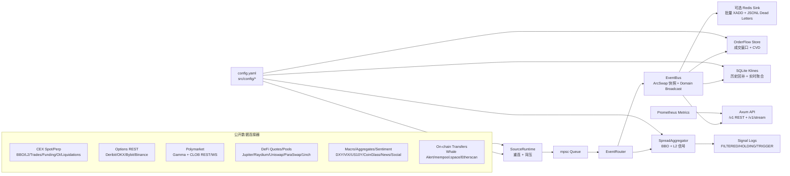

# MarketBridge 中文说明

MarketBridge 是一个独立的 Rust 市场数据桥接器，用来聚合交易所、期权、预测市场、DeFi、宏观、聚合行情、情绪和链上公开数据。它的定位是“数据源统一层”，不是交易机器人。

当前版本：`v0.0.2`

## 目录

- [项目定位](#项目定位)
- [系统架构](#系统架构)
- [运行流程](#运行流程)
- [下载二进制文件](#下载二进制文件)
- [从源码运行](#从源码运行)
- [配置说明](#配置说明)
- [数据源与 API Key](#数据源与-api-key)
- [已实现的数据源](#已实现的数据源)
- [API 总览](#api-总览)
- [常用接口示例](#常用接口示例)
- [WebSocket](#websocket)
- [指标与运维](#指标与运维)
- [重新发布 v0.0.2](#重新发布-v002)
- [边界说明](#边界说明)

## 项目定位

MarketBridge 负责：

- 采集公开市场数据：CEX、DeFi、期权、Polymarket、宏观、聚合行情、情绪、链上转账。
- 把不同来源的数据归一化成稳定的 REST / WebSocket 接口。
- 维护最新快照、数据新鲜度、source health、stale 标记。
- 输出可复用的数据特征，例如 basis、order flow、klines。
- 可选写入 Redis Stream，失败批次会落到本地 JSONL dead-letter 文件。

MarketBridge 不负责：

- 因子是否有效。
- 策略回测、paper PnL、实盘 PnL 归因。
- 钱包签名。
- Polymarket 下单、撤单、改单。
- 任何实盘交易执行。

下游项目，例如 `PolyAlpha`，应该调用 MarketBridge 获取数据，然后在自己的策略层做因子验证、paper decision、PnL 统计和实盘执行。

## 系统架构



## 运行流程

1. 各类公开数据连接器采集 CEX、期权、预测市场、DeFi、宏观、情绪、聚合行情和链上数据。
2. `SourceRuntime` 管理任务生命周期、断线重连和背压。
3. `EventRouter` 把事件分发给 `EventBus` 和 `SpreadAggregator`。
4. `EventBus` 保存 ArcSwap 最新快照，并按 domain 广播实时数据。
5. `OrderFlowStore` 从成交流中计算买卖压力和 CVD。
6. `KlineStore` 从历史 REST 和实时 tick 中生成 OHLCV。
7. REST / WebSocket / 可选 Redis 把数据暴露给下游策略系统。

各层职责边界：

| 层 | 负责 | 不负责 |
|---|---|---|
| Connector | 交易所协议、REST 轮询、WebSocket 订阅、symbol 转换、解析测试 | 跨源策略规则 |
| Domain | `DataEnvelope`、cache key、新鲜度、stale 标记、查询过滤 | 交易所级重连细节 |
| Runtime | source 监督、断线重连、背压、广播 fanout | 解释数据是否有 alpha |
| Derived Store | basis、order flow、klines、health summary | 因子审批或执行 |
| API | 稳定 REST / WebSocket / Redis 输出 | 钱包签名或下单路由 |

### 更新频率模型

MarketBridge 不会在进入缓存和流之前主动降采样 WebSocket 数据。交易所
推送一条就处理一条；REST 类数据源则使用配置或连接器内的轮询间隔，避免
无节制打爆公共 API。

| 数据类型 | 默认行为 |
|---|---|
| 核心 CEX WebSocket quotes/trades/books | 交易所推送速度 |
| Binance depth | `depth20@100ms` |
| Binance mark/funding | `markPrice@1s` |
| REST-only CEX | 通常 5 秒轮询 |
| 期权链 | `refresh_secs`，默认 10 秒 |
| Polymarket CLOB books | REST seed + WebSocket patch |
| Polymarket Gamma 市场发现 | `refresh_secs`，默认 300 秒 |
| DeFi quote/pool | `poll_secs`，默认 10 秒 |
| 链上大额转账 | `poll_secs`，默认 60 秒 |
| 宏观/情绪/聚合源 | 按 source 配置，通常 60 秒或更慢 |
| Spread 日志 | `runtime.report_interval_ms`，默认 1000 ms，最低 100 ms |
| `/v1/stream` snapshot domain | `snapshot_interval_ms`，默认 1000 ms，最低 250 ms |

如果目标是最高频原始数据，优先启用 WebSocket CEX，调高
`runtime.queue_capacity`，保持 `runtime.backpressure: drop_newest` 以降低延迟；
REST 轮询不要盲目压低，先确认对应公共 API 的限速。

## 下载二进制文件

`v0.0.2` 发布包由 GitHub Actions 构建。不同平台下载对应文件：

| 平台 | 下载文件 | 适用场景 |
|---|---|---|
| Linux 64 位 x86 | `market-bridge-v0.0.2-linux-x86_64.tar.gz` | 普通 64 位 Linux 服务器或桌面。 |
| Linux 32 位 x86 | `market-bridge-v0.0.2-linux-i686.tar.gz` | 仅 32 位 x86 Linux 使用。大多数用户不需要。 |
| macOS Intel | `market-bridge-v0.0.2-macos-x86_64.tar.gz` | Intel Mac。 |
| macOS Apple Silicon | `market-bridge-v0.0.2-macos-aarch64.tar.gz` | M1 / M2 / M3 / M4 Mac。 |
| Windows 64 位 | `market-bridge-v0.0.2-windows-x86_64.zip` | 64 位 Windows。 |

每个发布包包含：

- `market-bridge` 或 `market-bridge.exe`
- `README.md`
- `README.zh-CN.md`
- `config.yaml`
- `config.min.yaml`
- `config.all-exchanges.example.yaml`
- `docs/`
- `VERSION`

Linux / macOS：

```bash
tar -xzf market-bridge-v0.0.2-linux-x86_64.tar.gz
cd market-bridge-v0.0.2-linux-x86_64
chmod +x ./market-bridge
MARKETBRIDGE_CONFIG=./config.yaml ./market-bridge
```

如果是 macOS，第一次运行可能需要解除 quarantine：

```bash
xattr -d com.apple.quarantine ./market-bridge 2>/dev/null || true
```

Windows PowerShell：

```powershell
Expand-Archive .\market-bridge-v0.0.2-windows-x86_64.zip
cd .\market-bridge-v0.0.2-windows-x86_64\market-bridge-v0.0.2-windows-x86_64
$env:MARKETBRIDGE_CONFIG = ".\config.yaml"
.\market-bridge.exe
```

启动后，在另一个终端检查：

```bash
curl -s http://127.0.0.1:8080/health
curl -s "http://127.0.0.1:8080/v1/catalog/sources" | jq
curl -s "http://127.0.0.1:8080/v1/market/quotes?symbols=BTCUSDT" | jq
```

## 从源码运行

要求：

- Rust stable toolchain
- Linux、macOS 或 Windows
- 可选 Redis，仅在配置 `runtime.redis_url` 后启用

构建：

```bash
cargo build --release
```

从源码运行：

```bash
MARKETBRIDGE_CONFIG=./config.yaml cargo run
```

运行全交易所示例配置：

```bash
MARKETBRIDGE_CONFIG=./config.all-exchanges.example.yaml cargo run
```

直接运行编译后的二进制：

```bash
MARKETBRIDGE_CONFIG=./config.yaml ./target/release/market-bridge
```

Windows 路径：

```powershell
$env:MARKETBRIDGE_CONFIG = ".\config.yaml"
.\target\release\market-bridge.exe
```

## 配置说明

默认配置文件：`config.yaml`

发布包中有三个配置：

- `config.min.yaml`：最小烟雾测试配置。
- `config.yaml`：本地研究常用配置。
- `config.all-exchanges.example.yaml`：广覆盖示例，启用前建议按需求编辑。

重要字段：

- `runtime.queue_capacity`：source 到 router 的 channel 容量。
- `runtime.router_publish_queue_capacity`：router 到 bus worker 的 channel 容量；为 `0` 或省略时复用 `queue_capacity`。
- `runtime.broadcast_capacity`：WebSocket / Redis broadcast buffer。
- `runtime.backpressure`：`block` 或 `drop_newest`。
- `runtime.api_addr`：API 监听地址，默认 `0.0.0.0:8080`。
- `runtime.redis_url`：可选 Redis sink。
- `runtime.redis_stream_prefix`：Redis Stream 前缀。
- `runtime.redis_dead_letter_path`：Redis 多次写入失败后的 JSONL dead-letter 文件路径。
- `runtime.order_flow_large_trade_notional_usdt`：`/v1/market/order-flow` 的大单阈值。
- `runtime.ws_send_timeout_ms`：WebSocket 慢客户端发送超时。
- `strategy.fee_mode`：`taker`、`maker`、`maker_buy_taker_sell`、`taker_buy_maker_sell`。
- `strategy.book_signal_notional_usdt`：L2 book spread signal 使用的名义金额。
- `strategy.fallback_maker_fee_bps` / `strategy.fallback_taker_fee_bps`：没有显式交易所手续费配置时使用的保守手续费。
- `symbols`：全局 spot symbols。
- `perp_symbols`：全局 perp symbols。
- `exchanges.<name>.enabled`：交易所开关。
- `exchanges.<name>.symbols/perp_symbols`：交易所级别 symbol override。
- `exchanges.<name>.fee`：固定费率或分层费率模型。
- `klines.enabled`：是否启用 SQLite K 线存储。
- `onchain.*`：链上大额转账源配置。

需要 API key 的源可以通过配置或环境变量提供：

```bash
export COINGLASS_API_KEY="..."
export COINMARKETCAP_API_KEY="..."
export FRED_API_KEY="..."
export CRYPTOPANIC_API_KEY="..."
export SANTIMENT_API_KEY="..."
export LUNARCRUSH_API_KEY="..."
export WHALE_ALERT_API_KEY="..."
export ETHERSCAN_API_KEY="..."
export ARCHITECT_API_TOKEN="..."
export DECIBEL_API_TOKEN="..."
```

查看当前数据源是否启用、是否缺少 key：

```bash
curl -s "http://127.0.0.1:8080/v1/catalog/sources" | jq
```

状态含义：

- `enabled`：已启用，且需要的 key 已就绪。
- `available`：代码支持，但当前配置未启用。
- `enabled_missing_api_key`：已启用，但缺少必要 API key。

## 数据源与 API Key

完整的数据源、是否需要 API key、环境变量、接口使用方式，统一维护在
[`docs/data_sources.md`](docs/data_sources.md)。这里保留最常用的速查表：

| 数据源 | 是否需要 key | 环境变量 |
|---|---|---|
| 主流 CEX/perp 公共行情 | 通常不需要 | 无 |
| Deribit / OKX / Bybit / Binance 期权公开行情 | 不需要 | 无 |
| Polymarket Gamma / CLOB 公开数据 | 不需要 | 无 |
| DeFi 默认 quote / pool 数据 | 通常不需要 | 无，取决于自定义 gateway |
| DXY / VIX | 不需要 | 无 |
| mempool.space BTC mempool | 不需要 | 无 |
| Architect | 需要 bearer token | `ARCHITECT_API_TOKEN` |
| Decibel | 需要 bearer token | `DECIBEL_API_TOKEN` |
| CoinGecko | 可选 | `COINGECKO_API_KEY` |
| CoinCap | 可选 | `COINCAP_API_KEY` |
| CoinMarketCap | 需要 | `COINMARKETCAP_API_KEY` |
| CoinGlass | 需要 | `COINGLASS_API_KEY` |
| US10Y / FRED | 需要 | `FRED_API_KEY` |
| CryptoPanic | 需要 | `CRYPTOPANIC_API_KEY` |
| Santiment | 需要 | `SANTIMENT_API_KEY` |
| LunarCrush | 需要 | `LUNARCRUSH_API_KEY` |
| Whale Alert | 需要 | `WHALE_ALERT_API_KEY` |
| Etherscan | 需要 | `ETHERSCAN_API_KEY` |

原则：

- `keyless` 表示公共数据路径不需要用户凭证。
- `keyed` 表示启用后必须配置 key，否则 `/v1/catalog/sources` 会显示 `enabled_missing_api_key`。
- 交易所没有稳定公共端点的数据，不会被伪造；会在文档中标成 `n/a` 或 `partial`。

## 已实现的数据源

完整运行矩阵以 [`docs/feature_inventory.md`](docs/feature_inventory.md) 为准。
面向使用者的资料源说明以 [`docs/data_sources.md`](docs/data_sources.md) 为准。

### 数据与接口总矩阵

| 数据族 | 可以拿到什么 | 主接口 | WebSocket | 默认新鲜度/频率 | 是否需要 key |
|---|---|---|---|---|---|
| Spot 现货 quote | bid/ask/mid、source、symbol、stale | `GET /v1/market/quotes?product_type=spot` | `WS /v1/stream?domains=market_quote` | 有 WS 就按交易所推送；REST 通常 5 秒 | 否 |
| Perp 永续 quote | bid/ask/mid、mark/index 等公开字段 | `GET /v1/market/quotes?product_type=perp` | `WS /v1/stream?domains=market_quote` | 有 WS 就按交易所推送 | 否 |
| L2 订单簿 | bids/asks levels、best bid/ask、深度元数据 | `GET /v1/market/order-books` | `WS /v1/stream?domains=order_book` | 有 WS 就按源推送；Binance depth 为 `100ms` | 否 |
| 公共成交 trades | price、size、side、trade id、source timestamp | `GET /v1/market/trades` | `WS /v1/stream?domains=trade` | 有 WS 就按源推送 | 否 |
| Funding 资金费率 | funding rate、next funding、mark/index | `GET /v1/market/funding` | `WS /v1/stream?domains=funding` | WS 或交易所 poller | 否 |
| Open interest | OI 数量/名义金额 | `GET /v1/market/open-interest` | `WS /v1/stream?domains=open_interest` | WS 或交易所 poller | 否 |
| Liquidations 爆仓 | 公共强平事件 | `GET /v1/market/liquidations` | `WS /v1/stream?domains=liquidation` | 有稳定公共 feed 才推送 | 否 |
| Klines K 线 | SQLite OHLCV，REST 回补 + live ticks 聚合 | `GET /v1/market/klines` | 暂无直接流 | 默认 `1m/5m/15m/1h` | 否 |
| Basis | spot-perp basis、basis bps | `GET /v1/market/basis` | 暂无直接流 | 从最新 quote cache 派生 | 否 |
| Order flow | buy/sell pressure、delta、CVD、大单数量 | `GET /v1/market/order-flow` | 暂无直接流 | 从 live trades 派生 | 否 |
| Options 期权链 | strike、expiry、bid/ask/mark、IV 类字段、OI | `GET /v1/options/chains` | `WS /v1/stream?domains=options_chain` snapshot | REST cache，默认 10 秒 | 否 |
| Polymarket | YES/NO CLOB book、spread、midpoint、可执行价格、price history | `GET /v1/prediction/books`、`/polymarket/*` | `WS /v1/stream?domains=prediction_book` snapshot | REST seed + CLOB WS patch | 否 |
| DeFi | Jupiter/Raydium/Uniswap/ParaSwap/1inch/DexScreener quote 或 pool price | `GET /v1/market/quotes?exchanges=...` | 启用后走 `market_quote` | `poll_secs`，默认 10 秒 | 通常否，取决于 gateway |
| TradFi / Macro | DXY、VIX、US10Y | `GET /v1/market/quotes?exchanges=dxy,vix,us10y` | 启用后走 `market_quote` | 通常 60 秒或更慢 | US10Y 需要 FRED key |
| 聚合行情/衍生品信号 | CoinGecko/CoinCap/CMC price、CoinGlass derivatives metrics | `GET /v1/external/signals`，价格源也走 quote surface | `external_signal` | 通常 60 秒或更慢 | 部分需要 |
| 情绪/新闻 | Fear & Greed、CryptoPanic、Santiment、LunarCrush | `GET /v1/external/signals?sources=...` | `external_signal` | source-specific poll | Fear & Greed 不需要，其余多需要 |
| 链上大额转账 | Whale Alert、mempool.space BTC、Etherscan watched addresses | `GET /v1/onchain/transfers` | 暂无直接流 | 默认 60 秒 | Whale Alert/Etherscan 需要 |
| Catalog / Health | 数据源状态、key 状态、domain、instrument、freshness | `/v1/catalog/*`、`/coverage`、`/metrics` | 暂无 | 来自 runtime cache/metrics | 否 |
| Redis Stream | 标准化事件流导出 | `runtime.redis_url` | Redis Streams | batched XADD + JSONL dead letter | 需要 Redis |

### CEX

当前运行覆盖以 [`docs/feature_inventory.md`](docs/feature_inventory.md) 为准，CCXT 参考缺口盘点在 [`docs/ccxt_parity_audit.md`](docs/ccxt_parity_audit.md)。下面是 README 里的快速矩阵：

| 交易所 / 交易所组 | BBO | L2 | Trades | Funding | OI | Liquidations | 说明 |
|---|---:|---:|---:|---:|---:|---:|---|
| Binance / Bybit / OKX | 已实现 | 已实现 | 已实现 | 已实现 | 已实现 | 已实现 | 核心高流动性 spot/perp 公共数据。 |
| Hyperliquid / dYdX / Backpack / MEXC / BingX / Bitget / Bitmart | 已实现或部分 | 已实现 | 已实现 | 部分到已实现 | 部分到已实现 | 无稳定公共 feed 时标记为 n/a | 公共 feed 优先，缺口保持显式。 |
| BitMEX / Deribit / Phemex / CoinEx / Crypto.com / WOO X / BloFin / Aevo / Pacifica / GRVT / Injective / Derive / Evedex | 已实现或部分 | 已实现 | 已实现 | 已实现或交易所提供时已实现 | 已实现或交易所提供时已实现 | 已实现、partial 或 n/a | 原生 Rust perp/derivatives 数据路径。 |
| Coinbase / Kraken / KuCoin / Gemini / Bithumb / Bitvavo / bitFlyer / bitbank / Coincheck / Coinone / Upbit / Bullish | 已实现 | 已实现 | 已实现 | spot-only 时不适用 | spot-only 时不适用 | spot-only 或无公共 feed 时 n/a | 原生 spot REST/WS 公共行情、订单簿、成交。 |
| Gate / HTX / Bitfinex / Bitstamp / Bitrue / AscendEX / BTC Markets / Dexalot / Vertex / XRPL / Cube / Foxbit / NDAX | 已实现或部分 | 已实现 | 已实现或明确 n/a | 适用时已实现或 n/a | 适用时已实现、partial 或 n/a | 有稳定公共 feed 才实现，否则 n/a | 长尾和 CLOB/DEX 数据源按公共数据契约继续补强。 |

所有交易所连接器只做公开数据，不签名、不下单、不撤单，也不在运行时依赖第三方交易库。交易所没有稳定公共数据的 domain 会保持为空，不伪造信号。

### 期权

- Deribit option chains
- OKX Options
- Bybit Options
- Binance Options

统一接口：

```bash
curl -s "http://127.0.0.1:8080/v1/options/chains?venue=deribit&currency=BTC" | jq
```

### Polymarket

已实现：

- Gamma crypto market discovery
- CLOB REST book
- CLOB live cache
- midpoint batch
- spread batch
- last trade price batch
- executable BUY/SELL price batch
- price history

示例：

```bash
curl -s "http://127.0.0.1:8080/polymarket/crypto-markets?limit=500&max_offset=500" | jq
curl -s "http://127.0.0.1:8080/polymarket/live-books?token_ids=YES_TOKEN,NO_TOKEN" | jq
curl -s "http://127.0.0.1:8080/polymarket/midpoints?token_ids=YES_TOKEN,NO_TOKEN" | jq
```

### DeFi / 宏观 / 聚合 / 情绪 / 链上

- Jupiter
- Raydium
- Uniswap V3
- ParaSwap
- 1inch
- DXY
- VIX
- US10Y
- CoinGecko
- CoinMarketCap
- CoinGlass
- Fear & Greed
- CryptoPanic
- Santiment
- LunarCrush
- Whale Alert
- mempool.space
- Etherscan

## API 总览

Base URL：`http://127.0.0.1:8080`

| Method | Path | 说明 |
|---|---|---|
| GET | `/` | 服务元信息。 |
| GET | `/health` | 健康检查。 |
| GET | `/v1/catalog/sources` | 数据源启用状态和 API key 状态。 |
| GET | `/v1/catalog/source-roadmap` | 外部数据源清单和 MarketBridge 实现状态。 |
| GET | `/v1/catalog/domains` | 标准化 domain 清单。 |
| GET | `/v1/catalog/instruments` | 当前缓存中可见的 instruments。 |
| GET | `/v1/catalog/health` | source/domain 记录数和 freshness。 |
| GET | `/v1/market/quotes` | spot/perp/DeFi/TradFi/aggregate quote snapshots。 |
| GET | `/v1/market/basis` | spot-perp basis。 |
| GET | `/v1/market/funding` | funding rate。 |
| GET | `/v1/market/open-interest` | open interest。 |
| GET | `/v1/market/liquidations` | liquidation events。 |
| GET | `/v1/market/order-books` | L2 order book snapshots。 |
| GET | `/v1/market/trades` | recent trade snapshots。 |
| GET | `/v1/market/order-flow` | 买卖压力、delta、CVD。 |
| GET | `/v1/market/klines` | SQLite-backed OHLCV。 |
| GET | `/v1/options/chains` | 多交易所 option chains。 |
| GET | `/v1/prediction/books` | cached Polymarket books。 |
| GET | `/v1/external/signals` | 聚合、新闻、情绪、宏观信号。 |
| GET | `/v1/onchain/transfers` | 链上大额转账。 |
| GET | `/snapshot` | legacy 最新 tick 快照。 |
| GET | `/funding` | legacy funding view。 |
| GET | `/options/deribit/summary` | Deribit 实时 REST option summary。 |
| GET | `/options/deribit/live-summary` | Deribit 缓存 option summary。 |
| GET | `/polymarket/crypto-markets` | Polymarket BTC/ETH crypto market discovery。 |
| GET | `/polymarket/book` | 单个 Polymarket token order book。 |
| GET | `/polymarket/books` | 批量 Polymarket token order books。 |
| GET | `/polymarket/midpoints` | 批量 midpoint。 |
| GET | `/polymarket/spreads` | 批量 spread。 |
| GET | `/polymarket/last-trade-prices` | 批量 last trade price。 |
| GET | `/polymarket/prices` | 批量 BUY/SELL executable price。 |
| GET | `/polymarket/prices-history` | 单个或批量历史价格。 |
| GET | `/polymarket/crypto-books` | Crypto markets + REST books。 |
| GET | `/polymarket/live-books` | WebSocket 缓存 books。 |
| GET | `/polymarket/live-crypto-books` | Crypto markets + WebSocket 缓存 books。 |
| GET | `/coverage` | 数据质量 dashboard model。 |
| GET | `/metrics` | Prometheus metrics。 |
| WS | `/ws/ticks` | legacy tick stream。 |
| WS | `/v1/stream` | domain-filtered stream。 |

## 常用接口示例

### Quote

```bash
curl -s "http://127.0.0.1:8080/v1/market/quotes?symbols=BTCUSDT&product_type=perp" | jq
```

### Catalog

```bash
curl -s "http://127.0.0.1:8080/v1/catalog/sources" | jq
curl -s "http://127.0.0.1:8080/v1/catalog/source-roadmap" | jq
curl -s "http://127.0.0.1:8080/v1/catalog/domains" | jq
curl -s "http://127.0.0.1:8080/v1/catalog/instruments" | jq
curl -s "http://127.0.0.1:8080/v1/catalog/health" | jq
```

### Spot-perp basis

```bash
curl -s "http://127.0.0.1:8080/v1/market/basis?symbols=BTCUSDT&exchanges=binance,okx" | jq
```

### Funding / OI / L2 / Trades / Liquidations

这些端点共享常用过滤参数：

- `symbols=BTCUSDT,ETHUSDT`
- `exchanges=binance,okx,deribit`
- `market=spot|perp`，用于 `order-books` 和 `trades`

```bash
curl -s "http://127.0.0.1:8080/v1/market/funding?symbols=BTCUSDT&exchanges=binance,okx,deribit" | jq
curl -s "http://127.0.0.1:8080/v1/market/open-interest?symbols=BTCUSDT&exchanges=binance,okx,deribit" | jq
curl -s "http://127.0.0.1:8080/v1/market/order-books?symbols=BTCUSDT&market=perp&exchanges=binance,okx" | jq
curl -s "http://127.0.0.1:8080/v1/market/trades?symbols=BTCUSDT&market=perp&exchanges=binance,okx" | jq
curl -s "http://127.0.0.1:8080/v1/market/liquidations?symbols=BTCUSDT&exchanges=binance,bybit,okx" | jq
```

### Order flow

```bash
curl -s "http://127.0.0.1:8080/v1/market/order-flow?exchange=binance&market=perp&symbol=BTCUSDT&window_ms=60000" | jq
```

### Klines

```bash
curl -s "http://127.0.0.1:8080/v1/market/klines?exchange=binance&market=perp&symbol=BTCUSDT&interval=1m&limit=100" | jq
```

### Options

```bash
curl -s "http://127.0.0.1:8080/v1/options/chains?venue=bybit&currency=BTC&option_type=call" | jq
```

### Polymarket

```bash
curl -s "http://127.0.0.1:8080/polymarket/crypto-markets?limit=500&max_offset=500" | jq
curl -s "http://127.0.0.1:8080/polymarket/book?token_id=YES_TOKEN" | jq
curl -s "http://127.0.0.1:8080/polymarket/books?token_ids=YES_TOKEN,NO_TOKEN" | jq
curl -s "http://127.0.0.1:8080/polymarket/midpoints?token_ids=YES_TOKEN,NO_TOKEN" | jq
curl -s "http://127.0.0.1:8080/polymarket/spreads?token_ids=YES_TOKEN,NO_TOKEN" | jq
curl -s "http://127.0.0.1:8080/polymarket/last-trade-prices?token_ids=YES_TOKEN,NO_TOKEN" | jq
curl -s "http://127.0.0.1:8080/polymarket/prices?token_ids=YES_TOKEN&sides=BUY,SELL" | jq
curl -s "http://127.0.0.1:8080/polymarket/prices-history?token_id=YES_TOKEN&interval=1h&fidelity=1" | jq
curl -s "http://127.0.0.1:8080/polymarket/live-books?token_ids=YES_TOKEN,NO_TOKEN" | jq
curl -s "http://127.0.0.1:8080/v1/prediction/books?token_ids=YES_TOKEN,NO_TOKEN&include_stale=false" | jq
```

### DeFi / 宏观 / 聚合 / 情绪

```bash
curl -s "http://127.0.0.1:8080/v1/market/quotes?exchanges=jupiter,raydium,uniswap_v3,paraswap,oneinch" | jq
curl -s "http://127.0.0.1:8080/v1/market/quotes?exchanges=dxy,vix,us10y" | jq
curl -s "http://127.0.0.1:8080/v1/external/signals?sources=coinglass,fear_greed,cryptopanic,santiment,lunarcrush" | jq
curl -s "http://127.0.0.1:8080/v1/external/signals?sources=coinglass&symbols=BTC&metrics=funding,open_interest" | jq
```

### On-chain transfers

```bash
curl -s "http://127.0.0.1:8080/v1/onchain/transfers?source=whale_alert&asset=BTC&min_amount_usd=500000" | jq
```

### Data quality

```bash
curl -s "http://127.0.0.1:8080/coverage?market=perp&symbols=BTCUSDT" | jq
```

## WebSocket

推荐使用 `/v1/stream`。

支持 domain：

- `market_quote`
- `funding`
- `open_interest`
- `trade`
- `liquidation`
- `order_book`
- `external_signal`
- `options_chain`
- `prediction_book`

示例：

```bash
wscat -c "ws://127.0.0.1:8080/v1/stream?domains=market_quote&symbols=BTCUSDT&product_type=perp"
wscat -c "ws://127.0.0.1:8080/v1/stream?domains=funding&symbols=BTCUSDT&exchanges=binance,okx"
wscat -c "ws://127.0.0.1:8080/v1/stream?domains=order_book,trade&symbols=BTCUSDT&product_type=perp"
```

## 指标与运维

Prometheus：

```bash
curl -s http://127.0.0.1:8080/metrics
```

当前指标包括：

- `ticks_ingested_total`
- `bus_publish_total`
- `events_ingested_total{event_type=...}`
- `bus_events_published_total{event_type=...}`
- `ws_subscribers`
- `redis_xadd_total`
- `redis_dead_letter_total`
- `ticks_dropped_total`

Redis 是可选项。启用后如果批量写入 Redis 多次失败，MarketBridge 会把失败事件写入 `runtime.redis_dead_letter_path`，默认：

```text
data/redis_dead_letters.jsonl
```

## 重新发布 v0.0.2

如果需要重新切 `v0.0.2`，例如旧 release 是错的：

```bash
git tag -f v0.0.2 HEAD
git push origin master
git push --force origin refs/tags/v0.0.2
```

首次创建 tag 时：

```bash
git tag v0.0.2
git push origin v0.0.2
```

发布后确认 GitHub Release assets 是从最新 tag commit 构建的，不要拿旧 branch artifact 当正式发布。

## 边界说明

MarketBridge 是数据层。它可以给策略系统提供实时、统一、可检查的数据，但不代表任何因子已经有效，也不代表可以直接实盘交易。

对于 Polymarket 或其他预测市场策略，推荐流程是：

1. 用 MarketBridge 获取行情、订单簿、期权、宏观、链上和情绪数据。
2. 在 PolyAlpha 等策略层生成因子和 paper decision。
3. 做回测、paper PnL、成交可行性、退出逻辑验证。
4. 只有在策略层明确验证后，才考虑独立的执行系统。

不要把 MarketBridge 当成交易执行器。它现在不签名、不下单、不撤单。
