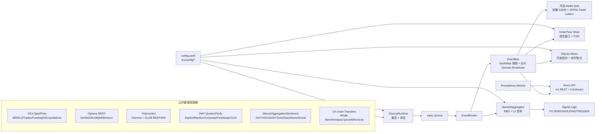

# MarketBridge

MarketBridge：多市场、多平台的市场数据与策略研究基座，统一接入实时与历史数据，支持机会扫描、成本分析、历史回放和模拟验证，对外提供 API，不负责下单。

通用的是基础设施，不是所有资产共用一套套利公式。以上是完整目标定位，
不代表全部能力已经实现；请查看[研发路线与验收门槛](docs/platform-roadmap.md)
和[开发验证记录](docs/development-log.md)，区分已实现、正在验证与后续规划。

当前版本：`v0.0.6`

未发布的研究 API / CLI 增量见[使用与限制](docs/research-api.md)。
`config.research.yaml` 提供仅监听本机、不启动采集源的研究服务配置。
完整操作教程见 [docs/user-guide](docs/user-guide/README.md)。当前源码自带 `/workbench`
研究工作台，无需额外 Node.js 服务；包括实验归档、扫描配置、事件与数据查询。
永续合约的负资金费率筛选、逼空结构复核与归档流程见
[逼空雷达实战指南](docs/user-guide/11-squeeze-radar.md)。

[English README](README.md)


## 目录

- [项目定位](#项目定位)
- [系统架构](#系统架构)
- [运行流程](#运行流程)
- [下载二进制文件](#下载二进制文件)
- [从源码运行](#从源码运行)
- [配置说明](#配置说明)
- [数据源与 API Key](#数据源与-api-key)
- [已实现的数据源](#已实现的数据源)
- [API 总览](#api-总览)
- [常用接口示例](#常用接口示例)
- [WebSocket](#websocket)
- [指标与运维](#指标与运维)
- [边界说明](#边界说明)

## 项目定位

MarketBridge 负责：

- 采集公开市场数据：CEX、DeFi、期权、Polymarket、宏观、聚合行情、情绪、链上转账。
- 把不同来源的数据归一化成稳定的 REST / WebSocket 接口。
- 维护最新快照、数据新鲜度、source health、stale 标记。
- 输出可复用的数据特征，例如 basis、order flow、klines。
- 可选写入 Redis Stream，失败批次会落到本地 JSONL dead-letter 文件。
- 按证据计算同资产成本曲线、回放给定场景，并记录预置库存的模拟成交账本。

MarketBridge 不负责：

- 因子是否有效。
- 保证因子有效、保证成交，或核对真实账户的实盘 PnL。
- 钱包签名。
- Polymarket 下单、撤单、改单。
- 任何实盘交易执行。

下游项目，例如 `PolyAlpha`，可以调用 MarketBridge 的数据与研究模型，在自己的策略层做决策、独立验证及实盘执行。基座内的模拟账本不是实盘下单能力；完整多资产组合、保证金及自动退出模型仍待实现。

深入阅读：
[`docs/README.md`](docs/README.md)、
[`docs/query_examples.md`](docs/query_examples.md)、
[`docs/architecture.md`](docs/architecture.md)、
[`docs/data_interfaces.md`](docs/data_interfaces.md)。

## 系统架构

更完整的架构、事件模型、API 边界和扩展方式见
[`docs/architecture.md`](docs/architecture.md)。


```mermaid
flowchart LR
  subgraph C[公开数据连接器]
    CEX[CEX Spot/Perp\nBBO/L2/Trades/Funding/OI/Liquidations]
    OPT[Options REST\nDeribit/OKX/Bybit/Binance]
    PM[Polymarket\nGamma + CLOB REST/WS]
    DEFI[DeFi Quotes/Pools\nJupiter/Raydium/Uniswap/ParaSwap/1inch]
    EXT[Macro/Aggregates/Sentiment\nDXY/VIX/US10Y/CoinGlass/News/Social]
    ON[On-chain Transfers\nWhale Alert/mempool.space/Etherscan]
  end

  C --> RT[SourceRuntime\n重连 + 背压]
  RT --> Q[mpsc Queue]
  Q --> R[EventRouter]

  R --> BUS[EventBus\nDashMap 快照 + 分片 Domain Broadcast]
  R --> AGG[SpreadAggregator\nBBO + L2 信号]
  BUS --> OF[OrderFlow Store\n成交窗口 + CVD]
  BUS --> K[SQLite Klines\n历史回补 + 实时聚合]

  AGG --> LOG[Signal Logs\nFILTERED/HOLDING/TRIGGER]
  BUS --> API[Axum API\n/v1 REST + /v1/stream]
  BUS --> REDIS[可选 Redis Sink\n批量 XADD + JSONL Dead Letters]

  CFG[config.yaml\nsrc/config/*] --> RT
  CFG --> AGG
  CFG --> K
  CFG --> OF
  MET[Prometheus Metrics] --> API
```

## 运行流程

1. 各类公开数据连接器采集 CEX、期权、预测市场、DeFi、宏观、情绪、聚合行情和链上数据。
2. `SourceRuntime` 管理任务生命周期、断线重连和背压。
3. `EventRouter` 把事件分发给 `EventBus` 和 `SpreadAggregator`。
4. `EventBus` 保存 DashMap 最新快照，并按 domain / shard 广播实时数据。
5. `OrderFlowStore` 从成交流中计算买卖压力和 CVD。
6. `KlineStore` 从历史 REST 和实时 tick 中生成 OHLCV。
7. REST / WebSocket / 可选 Redis 把数据暴露给下游策略系统。

各层职责边界：

| 层 | 负责 | 不负责 |
|---|---|---|
| Connector | 交易所协议、REST 轮询、WebSocket 订阅、symbol 转换、解析测试 | 跨源策略规则 |
| Domain | `DataEnvelope`、cache key、新鲜度、stale 标记、查询过滤 | 交易所级重连细节 |
| Runtime | source 监督、断线重连、背压、广播 fanout | 解释数据是否有 alpha |
| Derived Store | basis、order flow、klines、health summary | 因子审批或执行 |
| API | 稳定 REST / WebSocket / Redis 输出 | 钱包签名或下单路由 |

### 更新频率模型

MarketBridge 不会在进入缓存和流之前主动降采样 WebSocket 数据。交易所
推送一条就处理一条；REST 类数据源则使用配置或连接器内的轮询间隔，避免
无节制打爆公共 API。

| 数据类型 | 默认行为 |
|---|---|
| 核心 CEX WebSocket quotes/trades/books | 交易所推送速度 |
| Binance depth | `depth20@100ms` |
| Binance mark/funding | `markPrice@1s` |
| REST-only CEX | 通常 5 秒轮询 |
| 期权链 | `refresh_secs`，默认 10 秒 |
| Polymarket CLOB books | REST seed + WebSocket patch |
| Polymarket Gamma 市场发现 | `refresh_secs`，默认 300 秒 |
| DeFi quote/pool | `poll_secs`，默认 10 秒 |
| 链上大额转账 | `poll_secs`，默认 60 秒 |
| 宏观/情绪/聚合源 | 按 source 配置，通常 60 秒或更慢 |
| Spread 日志 | `runtime.report_interval_ms`，默认 1000 ms，最低 100 ms |
| `/v1/stream` snapshot domain | `snapshot_interval_ms`，默认 1000 ms，最低 250 ms |

如果目标是最高频原始数据，优先启用 WebSocket CEX，调高
`runtime.queue_capacity`，保持 `runtime.backpressure: drop_newest` 以降低延迟；
REST 轮询不要盲目压低，先确认对应公共 API 的限速。

## 下载二进制文件

最新版本请从 GitHub Releases 下载：
[https://github.com/tianrking/MarketBridge/releases/latest](https://github.com/tianrking/MarketBridge/releases/latest)。
历史版本列表：
[https://github.com/tianrking/MarketBridge/releases](https://github.com/tianrking/MarketBridge/releases)。

`v0.0.5` 发布包由 GitHub Actions 构建。不同平台下载对应文件：

| 平台 | 下载文件 | 适用场景 |
|---|---|---|
| Linux 64 位 x86 | `market-bridge-v0.0.5-linux-x86_64.tar.gz` | 普通 64 位 Linux 服务器或桌面。 |
| Linux 32 位 x86 | `market-bridge-v0.0.5-linux-i686.tar.gz` | 仅 32 位 x86 Linux 使用。大多数用户不需要。 |
| macOS Intel | `market-bridge-v0.0.5-macos-x86_64.tar.gz` | Intel Mac。 |
| macOS Apple Silicon | `market-bridge-v0.0.5-macos-aarch64.tar.gz` | M1 / M2 / M3 / M4 Mac。 |
| Windows 64 位 | `market-bridge-v0.0.5-windows-x86_64.zip` | 64 位 Windows。 |

每个发布包包含：

- `market-bridge` 或 `market-bridge.exe`
- `README.md`
- `README.zh-CN.md`
- `config.yaml`
- `config.min.yaml`
- `config.all-exchanges.example.yaml`
- `docs/`
- `VERSION`

Linux / macOS：

```bash
tar -xzf market-bridge-v0.0.5-linux-x86_64.tar.gz
cd market-bridge-v0.0.5-linux-x86_64
chmod +x ./market-bridge
MARKETBRIDGE_CONFIG=./config.yaml ./market-bridge
```

如果是 macOS，第一次运行可能需要解除 quarantine：

```bash
xattr -d com.apple.quarantine ./market-bridge 2>/dev/null || true
```

Windows PowerShell：

```powershell
Expand-Archive .\market-bridge-v0.0.5-windows-x86_64.zip
cd .\market-bridge-v0.0.5-windows-x86_64\market-bridge-v0.0.5-windows-x86_64
$env:MARKETBRIDGE_CONFIG = ".\config.yaml"
.\market-bridge.exe
```

启动后，在另一个终端检查：

```bash
curl -s http://127.0.0.1:8080/health
curl -s http://127.0.0.1:8080/v1/system/info | jq
curl -s "http://127.0.0.1:8080/v1/catalog/sources" | jq
curl -s "http://127.0.0.1:8080/v1/market/quotes?symbols=BTCUSDT" | jq
```

二进制程序跑起来后保持运行即可；后续用 `curl`、`jq` 或示例脚本调用本地
HTTP API。永续合约和资金费率的常见查询见：
[Perpetual Contract And Funding-Rate Cookbook](docs/perpetual_funding_cookbook.md)。

## 从源码运行

要求：

- Rust stable toolchain
- Linux、macOS 或 Windows
- 可选 Redis，仅在配置 `runtime.redis_url` 后启用

构建：

```bash
cargo build --release
```

从源码运行：

```bash
MARKETBRIDGE_CONFIG=./config.yaml cargo run
```

运行全交易所示例配置：

```bash
MARKETBRIDGE_CONFIG=./config.all-exchanges.example.yaml cargo run
```

直接运行编译后的二进制：

```bash
MARKETBRIDGE_CONFIG=./config.yaml ./target/release/market-bridge
```

Windows 路径：

```powershell
$env:MARKETBRIDGE_CONFIG = ".\config.yaml"
.\target\release\market-bridge.exe
```

## 配置说明

完整的运行配置、接口契约和二进制使用流程见
[`docs/data_interfaces.md`](docs/data_interfaces.md) 与
[`docs/usage_full.md`](docs/usage_full.md)。

默认配置文件：`config.yaml`

发布包中有三个配置：

- `config.min.yaml`：最小烟雾测试配置。
- `config.yaml`：本地研究常用配置。
- `config.all-exchanges.example.yaml`：广覆盖示例，启用前建议按需求编辑。

重要字段：

- `runtime.queue_capacity`：source 到 router 的 channel 容量。
- `runtime.router_publish_queue_capacity`：router 到 bus worker 的 channel 容量；为 `0` 或省略时复用 `queue_capacity`。
- `runtime.broadcast_capacity`：WebSocket / Redis broadcast buffer。
- `runtime.event_bus_shards`：event/domain broadcast 分片数；本地研究保持 `1`，多 symbol / 多订阅者压测确认后再调高。
- `runtime.backpressure`：`block` 或 `drop_newest`。
- `runtime.api_addr`：API 监听地址，默认 `0.0.0.0:8080`。
- `runtime.cors`：浏览器 UI 集成配置。默认允许 `localhost`、
  `127.0.0.1`、`https://*.pages.dev`、`https://*.vercel.app`，并启用
  Private Network Access 预检支持，方便托管网页访问本地 MarketBridge。
- `runtime.redis_url`：可选 Redis sink。
- `runtime.redis_stream_prefix`：Redis Stream 前缀。
- `runtime.redis_dead_letter_path`：Redis 多次写入失败后的 JSONL dead-letter 文件路径。
- `runtime.order_flow_large_trade_notional_usdt`：`/v1/market/order-flow` 的大单阈值。
- `runtime.ws_send_timeout_ms`：WebSocket 慢客户端发送超时。
- `strategy.fee_mode`：`taker`、`maker`、`maker_buy_taker_sell`、`taker_buy_maker_sell`。
- `strategy.book_signal_notional_usdt`：L2 book spread signal 使用的名义金额。
- `strategy.fallback_maker_fee_bps` / `strategy.fallback_taker_fee_bps`：没有显式交易所手续费配置时使用的保守手续费。
- `symbols`：全局 spot symbols。
- `perp_symbols`：全局 perp symbols。
- `exchanges.<name>.enabled`：交易所开关。
- `exchanges.<name>.symbols/perp_symbols`：交易所级别 symbol override。
- `exchanges.<name>.fee`：固定费率或分层费率模型。
- `klines.enabled`：是否启用 SQLite K 线存储。
- `onchain.*`：链上大额转账源配置。

需要 API key 的源可以通过配置或环境变量提供：

```bash
export COINGLASS_API_KEY="..."
export COINMARKETCAP_API_KEY="..."
export FRED_API_KEY="..."
export CRYPTOPANIC_API_KEY="..."
export SANTIMENT_API_KEY="..."
export LUNARCRUSH_API_KEY="..."
export WHALE_ALERT_API_KEY="..."
export ETHERSCAN_API_KEY="..."
export ARCHITECT_API_TOKEN="..."
export DECIBEL_API_TOKEN="..."
```

查看当前数据源是否启用、是否缺少 key：

```bash
curl -s "http://127.0.0.1:8080/v1/catalog/sources" | jq
```

状态含义：

- `enabled`：已启用，且需要的 key 已就绪。
- `available`：代码支持，但当前配置未启用。
- `enabled_missing_api_key`：已启用，但缺少必要 API key。

## 数据源与 API Key

完整的数据源、是否需要 API key、环境变量、接口使用方式，统一维护在
[`docs/data_sources.md`](docs/data_sources.md)。这里保留最常用的速查表：

| 数据源 | 是否需要 key | 环境变量 |
|---|---|---|
| 主流 CEX/perp 公共行情 | 通常不需要 | 无 |
| Deribit / OKX / Bybit / Binance 期权公开行情 | 不需要 | 无 |
| Polymarket Gamma / CLOB 公开数据 | 不需要 | 无 |
| DeFi 默认 quote / pool 数据 | 通常不需要 | 无，取决于自定义 gateway |
| DXY / VIX | 不需要 | 无 |
| US10Y | 需要 | `FRED_API_KEY` |
| CoinGecko / CoinCap | 可选 | `COINGECKO_API_KEY` / `COINCAP_API_KEY` |
| CoinMarketCap | 需要 | `COINMARKETCAP_API_KEY` |
| CoinGlass | 需要 | `COINGLASS_API_KEY` |
| CryptoPanic / Santiment / LunarCrush | 需要 | `CRYPTOPANIC_API_KEY` / `SANTIMENT_API_KEY` / `LUNARCRUSH_API_KEY` |
| mempool.space BTC mempool | 不需要 | 无 |
| Whale Alert / Etherscan | 需要 | `WHALE_ALERT_API_KEY` / `ETHERSCAN_API_KEY` |
| Architect | 需要 bearer token | `ARCHITECT_API_TOKEN` |
| Decibel | 需要 bearer token | `DECIBEL_API_TOKEN` |

原则：

- `keyless` 表示公共数据路径不需要用户凭证。
- `keyed` 表示启用后必须配置 key，否则 `/v1/catalog/sources` 会显示 `enabled_missing_api_key`。
- 交易所没有稳定公共端点的数据，不会被伪造；会在文档中标成 `n/a` 或 `partial`。

## 已实现的数据源

覆盖矩阵、数据源说明和缺口审计分别见
[`docs/feature_inventory.md`](docs/feature_inventory.md)、
[`docs/data_sources.md`](docs/data_sources.md)、
[`docs/ccxt_parity_audit.md`](docs/ccxt_parity_audit.md)。

完整运行矩阵以 [`docs/feature_inventory.md`](docs/feature_inventory.md) 为准。
面向使用者的资料源说明以 [`docs/data_sources.md`](docs/data_sources.md) 为准。

### 数据与接口总矩阵

| 数据族 | 可以拿到什么 | 主接口 | WebSocket | 默认新鲜度/频率 | 是否需要 key |
|---|---|---|---|---|---|
| Spot 现货 quote | bid/ask/mid、source、symbol、stale | `GET /v1/market/quotes?product_type=spot` | `WS /v1/stream?domains=market_quote` | 有 WS 就按交易所推送；REST 通常 5 秒 | 否 |
| Perp 永续 quote | bid/ask/mid、mark/index 等公开字段 | `GET /v1/market/quotes?product_type=perp` | `WS /v1/stream?domains=market_quote` | 有 WS 就按交易所推送 | 否 |
| L2 订单簿 | bids/asks levels、best bid/ask、深度元数据 | `GET /v1/market/order-books` | `WS /v1/stream?domains=order_book` | 有 WS 就按源推送；Binance depth 为 `100ms` | 否 |
| 公共成交 trades | price、size、side、trade id、source timestamp | `GET /v1/market/trades` | `WS /v1/stream?domains=trade` | 有 WS 就按源推送 | 否 |
| Funding 资金费率 | funding rate、next funding、mark/index | `GET /v1/market/funding` | `WS /v1/stream?domains=funding` | WS 或交易所 poller | 否 |
| 永续合约发现 | 某交易所当前公开列出的永续合约清单 | `GET /v1/catalog/perpetuals`、`GET /v1/catalog/markets` | 暂无直接流 | 按需请求交易所公开 REST | 否 |
| 按需永续资金费率 | 支持交易所的当前永续资金费率全量行，不限于配置 symbol | `GET /v1/market/perpetual-funding` | 暂无直接流 | 按需请求交易所公开 REST | 否 |
| Open interest | OI 数量/名义金额 | `GET /v1/market/open-interest` | `WS /v1/stream?domains=open_interest` | WS 或交易所 poller | 否 |
| Liquidations 爆仓 | 公共强平事件 | `GET /v1/market/liquidations` | `WS /v1/stream?domains=liquidation` | 有稳定公共 feed 才推送 | 否 |
| Klines K 线 | SQLite OHLCV，REST 回补 + live ticks 聚合 | `GET /v1/market/klines` | 暂无直接流 | 默认 `1m/5m/15m/1h` | 否 |
| Basis | spot-perp basis、basis bps | `GET /v1/market/basis` | 暂无直接流 | 从最新 quote cache 派生 | 否 |
| Order flow | buy/sell pressure、delta、CVD、大单数量 | `GET /v1/market/order-flow` | 暂无直接流 | 从 live trades 派生 | 否 |
| Options 期权链 | strike、expiry、bid/ask/mark、IV 类字段、OI | `GET /v1/options/chains` | `WS /v1/stream?domains=options_chain` snapshot | REST cache，默认 10 秒 | 否 |
| Polymarket | YES/NO CLOB book、spread、midpoint、可执行价格、price history、公开 trade history | `GET /v1/prediction/books`、`/v1/prediction/trades`、`/polymarket/*` | `WS /v1/stream?domains=prediction_book` snapshot | REST seed + CLOB WS patch + Data API history | 否 |
| DeFi | Jupiter/Raydium/Uniswap/ParaSwap/1inch/DexScreener quote 或 pool price | `GET /v1/market/quotes?exchanges=...` | 启用后走 `market_quote` | `poll_secs`，默认 10 秒 | 通常否，取决于 gateway |
| TradFi / Macro | DXY、VIX、US10Y | `GET /v1/market/quotes?exchanges=dxy,vix,us10y` | 启用后走 `market_quote` | 通常 60 秒或更慢 | US10Y 需要 FRED key |
| 聚合行情/衍生品信号 | CoinGecko/CoinCap/CMC price、CoinGlass derivatives metrics | `GET /v1/external/signals`，价格源也走 quote surface | `external_signal` | 通常 60 秒或更慢 | 部分需要 |
| 情绪/新闻 | Fear & Greed、CryptoPanic、Santiment、LunarCrush | `GET /v1/external/signals?sources=...` | `external_signal` | source-specific poll | Fear & Greed 不需要，其余多需要 |
| 天气观察 | Open-Meteo forecast/archive | `GET /v1/external/weather` | 按需只读 | keyless；坐标、模型、市场 bucket 与结算规则需调用者明确 |
| 链上大额转账 | Whale Alert、mempool.space BTC、Etherscan watched addresses | `GET /v1/onchain/transfers` | 暂无直接流 | 默认 60 秒 | Whale Alert/Etherscan 需要 |
| Catalog / Health | 数据源状态、key 状态、domain、instrument、freshness | `/v1/catalog/*`、`/coverage`、`/metrics` | 暂无 | 来自 runtime cache/metrics | 否 |
| Redis Stream | 标准化事件流导出 | `runtime.redis_url` | Redis Streams | batched XADD + JSONL dead letter | 需要 Redis |

### CEX

当前运行覆盖以 [`docs/feature_inventory.md`](docs/feature_inventory.md) 为准，CCXT 参考缺口盘点在 [`docs/ccxt_parity_audit.md`](docs/ccxt_parity_audit.md)。下面是 README 里的快速矩阵：

| 交易所 / 交易所组 | BBO | L2 | Trades | Funding | OI | Liquidations | 说明 |
|---|---:|---:|---:|---:|---:|---:|---|
| Binance / Bybit / OKX | 已实现 | 已实现 | 已实现 | 已实现 | 已实现 | 已实现 | 核心高流动性 spot/perp 公共数据。 |
| Hyperliquid / dYdX / Backpack / MEXC / BingX / Bitget / Bitmart | 已实现或部分 | 已实现 | 已实现 | 部分到已实现 | 部分到已实现 | 无稳定公共 feed 时标记为 n/a | 公共 feed 优先，缺口保持显式。 |
| BitMEX / Deribit / Phemex / CoinEx / Crypto.com / WOO X / BloFin / Aevo / Pacifica / GRVT / Injective / Derive / Evedex | 已实现或部分 | 已实现 | 已实现 | 已实现或交易所提供时已实现 | 已实现或交易所提供时已实现 | 已实现、partial 或 n/a | 原生 Rust perp/derivatives 数据路径。 |
| Coinbase / Kraken / KuCoin / Gemini / Bithumb / Bitvavo / bitFlyer / bitbank / Coincheck / Coinone / Upbit / Bullish | 已实现 | 已实现 | 已实现 | spot-only 时不适用 | spot-only 时不适用 | spot-only 或无公共 feed 时 n/a | 原生 spot REST/WS 公共行情、订单簿、成交。 |
| Gate / HTX / Bitfinex / Bitstamp / Bitrue / AscendEX / BTC Markets / Dexalot / Vertex / XRPL / Cube / Foxbit / NDAX | 已实现或部分 | 已实现 | 已实现或明确 n/a | 适用时已实现或 n/a | 适用时已实现、partial 或 n/a | 有稳定公共 feed 才实现，否则 n/a | 长尾和 CLOB/DEX 数据源按公共数据契约继续补强。 |

所有交易所连接器只做公开数据，不签名、不下单、不撤单，也不在运行时依赖第三方交易库。交易所没有稳定公共数据的 domain 会保持为空，不伪造信号。

### 期权

- Deribit option chains
- OKX Options
- Bybit Options
- Binance Options

统一接口：

```bash
curl -s "http://127.0.0.1:8080/v1/options/chains?venue=deribit&currency=BTC" | jq
```

### Polymarket

已实现：

- Gamma crypto market discovery
- CLOB REST book
- CLOB live cache
- midpoint batch
- spread batch
- last trade price batch
- executable BUY/SELL price batch
- price history

示例：

```bash
curl -s "http://127.0.0.1:8080/polymarket/crypto-markets?limit=500&max_offset=500" | jq
curl -s "http://127.0.0.1:8080/polymarket/live-books?token_ids=YES_TOKEN,NO_TOKEN" | jq
curl -s "http://127.0.0.1:8080/polymarket/midpoints?token_ids=YES_TOKEN,NO_TOKEN" | jq
```

### DeFi / 宏观 / 聚合 / 情绪 / 链上

- Jupiter
- Raydium
- Uniswap V3
- ParaSwap
- 1inch
- DXY
- VIX
- US10Y
- CoinGecko
- CoinMarketCap
- CoinGlass
- Fear & Greed
- CryptoPanic
- Santiment
- LunarCrush
- Whale Alert
- mempool.space
- Etherscan

## API 总览

完整 API 合约、参数和返回字段见
[`docs/data_interfaces.md`](docs/data_interfaces.md)；完整使用路径见
[`docs/usage_full.md`](docs/usage_full.md)。

Base URL：`http://127.0.0.1:8080`

| Method | Path | 说明 |
|---|---|---|
| GET | `/` | 服务元信息。 |
| GET | `/health` | 健康检查。 |
| GET | `/v1/system/info` | 版本、API 版本、本地 UI 连接提示和能力清单。 |
| GET | `/v1/system/provider-quotas` | 本地自定义来源共享配额窗口与剩余额度。 |
| GET | `/v1/catalog/sources` | 数据源启用状态和 API key 状态。 |
| GET | `/v1/catalog/search` | 产品搜索：输入资产或 symbol，返回在哪里交易以及能获取哪些数据。 |
| GET | `/v1/catalog/markets` | 按需查询交易所公开 market/symbol 清单。 |
| GET | `/v1/catalog/perpetuals` | 按交易所分组查询永续合约清单。 |
| GET | `/v1/catalog/source-roadmap` | 外部数据源清单和 MarketBridge 实现状态。 |
| GET | `/v1/catalog/domains` | 标准化 domain 清单。 |
| GET | `/v1/catalog/instruments` | 当前缓存中可见的 instruments。 |
| GET | `/v1/catalog/health` | source/domain 记录数和 freshness。 |
| GET | `/v1/market/quotes` | spot/perp/DeFi/TradFi/aggregate quote snapshots。 |
| GET | `/v1/market/basis` | spot-perp basis。 |
| GET | `/v1/market/funding` | funding rate。 |
| GET | `/v1/market/perpetual-funding` | 按需查询支持交易所的当前永续资金费率。 |
| GET | `/v1/market/open-interest` | open interest。 |
| GET | `/v1/market/liquidations` | liquidation events。 |
| GET | `/v1/market/order-books` | L2 order book snapshots。 |
| GET | `/v1/market/trades` | recent trade snapshots。 |
| GET | `/v1/market/order-flow` | 买卖压力、delta、CVD。 |
| GET | `/v1/market/order-flow/windows` | 多窗口 order-flow 和 CVD。 |
| GET | `/v1/market/footprint` | footprint / orderflow profile。 |
| GET | `/v1/market/klines` | SQLite-backed OHLCV。 |
| GET | `/v1/history/candles` | 按需查询 spot/futures/mark/index/premiumIndex/funding-rate candles；返回 `coverage_detail`，funding history 另附逐点 schedule。 |
| GET | `/v1/history/liquidations` | OKX/CoinEx bounded recent public liquidation history，供回放使用；其他 venue 缺口保持显式。 |
| GET | `/v1/history/open-interest` | Binance/Bybit 公开历史 OI 观察，保留 provider unit 和 `coverage_detail`；不代表多空方向。 |
| GET | `/v1/history/trades` | Binance/OKX bounded public trades，保留 taker side，供 CVD/order-flow 回放。 |
| GET | `/v1/storage/manifest` | 本地 Arrow IPC lake manifest 和质量元数据。 |
| DELETE | `/v1/storage/partitions` | 按过滤条件删除本地 lake partitions。 |
| GET | `/v1/universe/top-volume` | 按成交量筛选 universe。 |
| GET | `/v1/universe/percent-change` | 按涨跌幅筛选 universe。 |
| GET | `/v1/universe/volatility` | 按 realized volatility 筛选 universe。 |
| GET | `/v1/universe/spread-filter` | 按当前 spread 筛选 universe。 |
| GET | `/v1/universe/cross-market` | 查询跨市场 / 跨交易所可见性。 |
| GET | `/v1/universe/market-cap` | 按 market cap 排名。 |
| GET | `/v1/universe/age-filter` | 按 listing age 筛选。 |
| GET | `/v1/universe/new-listings` | 最近 listing candidates。 |
| GET | `/v1/universe/delist-risk` | 历史标的缺失 / stale quote risk。 |
| GET | `/v1/research/features` | 多周期 research feature package。 |
| GET | `/v1/research/market-regime` | 市场 regime snapshot。 |
| GET | `/v1/research/symbol-state` | 单标的 squeeze / exhaustion 状态机。 |
| GET | `/v1/integration/context` | 面向外部集成的紧凑只读市场上下文。 |
| GET | `/v1/integration/capabilities` | 只读集成能力清单。 |
| GET | `/v1/options/chains` | 多交易所 option chains。 |
| GET | `/v1/prediction/books` | cached Polymarket books。 |
| GET | `/v1/external/signals` | 聚合、新闻、情绪、宏观信号。 |
| GET | `/v1/onchain/transfers` | 链上大额转账。 |
| GET | `/snapshot` | legacy 最新 tick 快照。 |
| GET | `/funding` | legacy funding view。 |
| GET | `/options/deribit/summary` | Deribit 实时 REST option summary。 |
| GET | `/options/deribit/live-summary` | Deribit 缓存 option summary。 |
| GET | `/options/deribit/book` | Deribit 单 instrument option book。 |
| GET | `/options/okx/book` | OKX 单 instrument option book。 |
| GET | `/options/bybit/book` | Bybit 单 instrument option book。 |
| GET | `/options/binance/book` | Binance 单 instrument option book。 |
| GET | `/polymarket/markets` | Polymarket Gamma active/closed market discovery；`include_closed=true` 可取结算市场，`order`/`ascending` 可复现分页顺序。 |
| GET | `/polymarket/crypto-markets` | Polymarket BTC/ETH crypto market discovery。 |
| GET | `/polymarket/book` | 单个 Polymarket token order book。 |
| GET | `/polymarket/books` | 批量 Polymarket token order books。 |
| GET | `/polymarket/midpoints` | 批量 midpoint。 |
| GET | `/polymarket/spreads` | 批量 spread。 |
| GET | `/polymarket/last-trade-prices` | 批量 last trade price。 |
| GET | `/polymarket/prices` | 批量 BUY/SELL executable price。 |
| GET | `/polymarket/prices-history` | 单个或批量历史价格。 |
| GET | `/polymarket/crypto-books` | Crypto markets + REST books。 |
| GET | `/polymarket/live-books` | WebSocket 缓存 books。 |
| GET | `/polymarket/live-crypto-books` | Crypto markets + WebSocket 缓存 books。 |
| GET | `/coverage` | 数据质量 dashboard model。 |
| GET | `/metrics` | Prometheus metrics。 |
| WS | `/ws/ticks` | legacy tick stream。 |
| WS | `/v1/stream` | domain-filtered stream。 |

## 常用接口示例

更多“找币、找交易所、找资金费率、找涨跌幅、跨交易所对比、导出 CSV、
生成 watchlist”的复制即用命令见
[`docs/query_examples.md`](docs/query_examples.md)。

### Quote

```bash
curl -s "http://127.0.0.1:8080/v1/market/quotes?symbols=BTCUSDT&product_type=perp" | jq
```

### Catalog

```bash
curl -s "http://127.0.0.1:8080/v1/system/info" | jq
curl -s "http://127.0.0.1:8080/v1/catalog/sources" | jq
curl -s "http://127.0.0.1:8080/v1/catalog/source-roadmap" | jq
curl -s "http://127.0.0.1:8080/v1/catalog/domains" | jq
curl -s "http://127.0.0.1:8080/v1/catalog/instruments" | jq
curl -s "http://127.0.0.1:8080/v1/catalog/health" | jq
curl -s "http://127.0.0.1:8080/v1/catalog/search?q=HOME&exchanges=binance,okx,bybit,bitget,gate,mexc" | jq
curl -s "http://127.0.0.1:8080/v1/catalog/perpetuals?exchange=binance&quote=USDT&limit=20" | jq
```

### 永续合约发现与按需资金费率

这组接口是数据面能力，不是策略扫描器。MarketBridge 负责适配不同交易所
公开 REST 格式并返回统一字段；客户端自己决定 watchlist、阈值、告警和监控逻辑。

#### `GET /v1/catalog/search`

面向 UI 和客户端的产品搜索入口。用户输入 `HOME`、`HOMEUSDT` 这类资产或
symbol，MarketBridge 返回它在哪些交易所、有哪些 spot/perp 市场、quote
资产、可用数据域、派生指标，以及可直接调用的 REST/WebSocket endpoint。

参数：

- `q=HOME` 或 `product=HOMEUSDT`：用户输入。
- `base=HOME`：显式指定 base asset。
- `symbol=HOMEUSDT`：按具体 symbol 搜索。
- `exchanges=binance,okx,bybit`：可选交易所过滤。
- `market=spot|perp`：可选市场类型过滤。
- `quote=USDT`：可选 quote 过滤。
- `include_endpoints=true|false`：是否返回可调用 endpoint，默认 `true`。

示例：

```bash
curl -s "http://127.0.0.1:8080/v1/catalog/search?q=HOME" | jq
curl -s "http://127.0.0.1:8080/v1/catalog/search?q=HOMEUSDT&market=perp" | jq
curl -s "http://127.0.0.1:8080/v1/catalog/search?base=HOME&exchanges=binance,okx,bybit,bitget,gate,mexc" | jq
```

#### `GET /v1/catalog/markets`

查询某个或多个交易所的公开 market/symbol 清单。

参数：

- `exchange=binance`：单个交易所。
- `exchanges=binance,okx,bybit`：多个交易所。
- `market=spot|perp|swap`：可选，不传时包含支持的 spot/perp。
- `quote=USDT`：可选 quote 过滤。
- `base=BTC`：可选 base 过滤。
- `active_only=true|false`：默认 `true`。
- `limit`：默认 `5000`，最大 `50000`。

返回：

- 顶层字段：`version`、`domain`、`supported_exchanges`、`markets`、`errors`。
- `markets[]`：`exchange`、`market`、`symbol`、`native_symbol`、`base`、
  `quote`、`active`、`status`、`contract_type`、`settle_asset`、`source`。
- `errors[]`：按交易所返回适配器错误；如果结果为空但 `errors` 不为空，
  表示至少有一个交易所请求失败，不应误判为“没有标的”。

示例：

```bash
curl -s "http://127.0.0.1:8080/v1/catalog/markets?exchange=binance&market=perp&quote=USDT&limit=20" | jq
curl -s "http://127.0.0.1:8080/v1/catalog/markets?exchanges=okx,bybit,bitget&market=spot&quote=USDT" | jq
```

#### `GET /v1/catalog/perpetuals`

直接回答“某个平台现在有哪些永续合约”。返回结果按交易所分组，适合客户端
先拿全量 universe，再选择自己要监控的 symbol。

参数：

- `exchange=bybit` 或 `exchanges=binance,okx,bybit`。
- `quote=USDT`：可选。
- `base=BTC`：可选。
- `active_only=true|false`：默认 `true`。
- `limit`：每个交易所的返回上限，默认 `50000`。

返回：

- 顶层字段：`version`、`domain`、`supported_exchanges`、`exchanges`、`errors`。
- `exchanges[]`：`exchange`、`contracts_total`、`contracts_returned`、
  `base_assets_total`、`base_assets`、`contracts`。
- `contracts[]`：字段同 `/v1/catalog/markets` 的 `markets[]`。

示例：

```bash
curl -s "http://127.0.0.1:8080/v1/catalog/perpetuals?exchange=okx&quote=USDT&limit=50" | jq
curl -s "http://127.0.0.1:8080/v1/catalog/perpetuals?exchanges=binance,bybit,bitget&quote=USDT&limit=10" | jq
```

#### `GET /v1/market/perpetual-funding`

按需查询支持交易所的当前永续资金费率。这个接口不局限于 `config.yaml`
里配置的 symbol，适合先发现交易所全量永续标的，再在客户端做监控和筛选。

更多可直接复制的常见查询、`curl + jq`、CSV 导出、跨交易所对比和 watchlist
生成示例见：[Perpetual Contract And Funding-Rate Cookbook](docs/perpetual_funding_cookbook.md)。
更完整的 100+ 条场景化查询见
[`docs/query_examples.md`](docs/query_examples.md)。

第一批支持：`binance`、`okx`、`bybit`、`bitget`、`kucoin`、`gate`、
`mexc`、`bingx`、`bitmart`。

参数：

- `exchange=bybit` 或 `exchanges=binance,okx,bybit`。
- `symbols=BTCUSDT,ETHUSDT`：可选，只看指定标准化 symbol。
- `quote=USDT`：可选。
- `active_only=true|false`：默认 `true`。
- `limit`：默认 `5000`，最大 `50000`。

返回：

- 顶层字段：`version`、`domain`、`supported_exchanges`、`funding`、`errors`。
- `funding[]`：`exchange`、`symbol`、`native_symbol`、`funding_rate`、
  `funding_rate_pct`、`next_funding_time_ms`、`funding_interval_ms`、`mark_price`、`index_price`、
  `active`、`source`、`ts_ms`。
- `funding_interval_ms` 只在 provider 明确提供结算周期时出现；缺失时客户端必须暂停跨周期年化比较。
- `funding_rate` 是小数，例如 `-0.001`。
- `funding_rate_pct` 已经是百分比，例如 `-0.1` 表示 `-0.1%`。

示例：

```bash
curl -s "http://127.0.0.1:8080/v1/market/perpetual-funding?exchange=bybit&quote=USDT&limit=50000" | jq
curl -s "http://127.0.0.1:8080/v1/market/perpetual-funding?exchanges=binance,okx,bitget&symbols=BTCUSDT,ETHUSDT" | jq
```

客户端筛选 Binance 资金费率在 `-2%` 到 `-0.2%` 的永续合约：

```bash
curl -s "http://127.0.0.1:8080/v1/market/perpetual-funding?exchange=binance&quote=USDT&limit=50000" \
| jq '.funding
  | map(select(.funding_rate_pct >= -2 and .funding_rate_pct <= -0.2))
  | sort_by(.funding_rate_pct)
  | .[]
  | {exchange, symbol, funding_rate_pct, mark_price, next_funding_time_ms}'
```

多个交易所一起筛选：

```bash
curl -s "http://127.0.0.1:8080/v1/market/perpetual-funding?exchanges=binance,okx,bybit,bitget&quote=USDT&limit=50000" \
| jq '.funding
  | map(select(.funding_rate_pct >= -2 and .funding_rate_pct <= -0.2))
  | sort_by(.funding_rate_pct)
  | .[]
  | {exchange, symbol, funding_rate_pct, mark_price, next_funding_time_ms}'
```

### Spot-perp basis

```bash
curl -s "http://127.0.0.1:8080/v1/market/basis?symbols=BTCUSDT&exchanges=binance,okx" | jq
```

### Funding / OI / L2 / Trades / Liquidations

这些端点共享常用过滤参数：

- `symbols=BTCUSDT,ETHUSDT`
- `exchanges=binance,okx,deribit`
- `market=spot|perp`，用于 `order-books` 和 `trades`

```bash
curl -s "http://127.0.0.1:8080/v1/market/funding?symbols=BTCUSDT&exchanges=binance,okx,deribit" | jq
curl -s "http://127.0.0.1:8080/v1/market/open-interest?symbols=BTCUSDT&exchanges=binance,okx,deribit" | jq
curl -s "http://127.0.0.1:8080/v1/market/order-books?symbols=BTCUSDT&market=perp&exchanges=binance,okx" | jq
curl -s "http://127.0.0.1:8080/v1/market/trades?symbols=BTCUSDT&market=perp&exchanges=binance,okx" | jq
curl -s "http://127.0.0.1:8080/v1/market/liquidations?symbols=BTCUSDT&exchanges=binance,bybit,okx" | jq
```

### Order flow

```bash
curl -s "http://127.0.0.1:8080/v1/market/order-flow?exchange=binance&market=perp&symbol=BTCUSDT&window_ms=60000" | jq
```

### Klines

```bash
curl -s "http://127.0.0.1:8080/v1/market/klines?exchange=binance&market=perp&symbol=BTCUSDT&interval=1m&limit=100" | jq
```

### Options

```bash
curl -s "http://127.0.0.1:8080/v1/options/chains?venue=bybit&currency=BTC&option_type=call" | jq
```

### Polymarket

```bash
curl -s "http://127.0.0.1:8080/polymarket/crypto-markets?limit=500&max_offset=500" | jq
curl -s "http://127.0.0.1:8080/polymarket/book?token_id=YES_TOKEN" | jq
curl -s "http://127.0.0.1:8080/polymarket/books?token_ids=YES_TOKEN,NO_TOKEN" | jq
curl -s "http://127.0.0.1:8080/polymarket/midpoints?token_ids=YES_TOKEN,NO_TOKEN" | jq
curl -s "http://127.0.0.1:8080/polymarket/spreads?token_ids=YES_TOKEN,NO_TOKEN" | jq
curl -s "http://127.0.0.1:8080/polymarket/last-trade-prices?token_ids=YES_TOKEN,NO_TOKEN" | jq
curl -s "http://127.0.0.1:8080/polymarket/prices?token_ids=YES_TOKEN&sides=BUY,SELL" | jq
curl -s "http://127.0.0.1:8080/polymarket/prices-history?token_id=YES_TOKEN&interval=1h&fidelity=1" | jq
curl -s "http://127.0.0.1:8080/polymarket/live-books?token_ids=YES_TOKEN,NO_TOKEN" | jq
curl -s "http://127.0.0.1:8080/v1/prediction/books?token_ids=YES_TOKEN,NO_TOKEN&include_stale=false" | jq
```

### DeFi / 宏观 / 聚合 / 情绪

```bash
curl -s "http://127.0.0.1:8080/v1/market/quotes?exchanges=jupiter,raydium,uniswap_v3,paraswap,oneinch" | jq
curl -s "http://127.0.0.1:8080/v1/market/quotes?exchanges=dxy,vix,us10y" | jq
curl -s "http://127.0.0.1:8080/v1/external/signals?sources=coinglass,fear_greed,cryptopanic,santiment,lunarcrush" | jq
curl -s "http://127.0.0.1:8080/v1/external/signals?sources=coinglass&symbols=BTC&metrics=funding,open_interest" | jq
```

### On-chain transfers

```bash
curl -s "http://127.0.0.1:8080/v1/onchain/transfers?source=whale_alert&asset=BTC&min_amount_usd=500000" | jq
```

### Data quality

```bash
curl -s "http://127.0.0.1:8080/coverage?market=perp&symbols=BTCUSDT" | jq
```

## WebSocket

WebSocket domain、snapshot streaming 和连接模型的细节见
[`docs/data_interfaces.md`](docs/data_interfaces.md) 与
[`docs/architecture.md`](docs/architecture.md)。

推荐使用 `/v1/stream`。

支持 domain：

- `market_quote`
- `funding`
- `open_interest`
- `trade`
- `liquidation`
- `order_book`
- `external_signal`
- `options_chain`
- `prediction_book`

示例：

```bash
wscat -c "ws://127.0.0.1:8080/v1/stream?domains=market_quote&symbols=BTCUSDT&product_type=perp"
wscat -c "ws://127.0.0.1:8080/v1/stream?domains=funding&symbols=BTCUSDT&exchanges=binance,okx"
wscat -c "ws://127.0.0.1:8080/v1/stream?domains=order_book,trade&symbols=BTCUSDT&product_type=perp"
```

## 性能与本地压测

性能复盘、事件广播、序列化和缓存扫描优化细节见
[`docs/performance_review.md`](docs/performance_review.md)。

当前高频路径已经做了几件关键优化：

- `EventRouter` 将同一个 `Arc<DataEvent>` 同步给 `EventBus` 和 `SpreadAggregator`，大型 L2 order book 不会因为进入分析器再复制一份完整 levels。
- 最新快照使用 DashMap 原地更新，避免每条 tick 全量 clone 快照 map。
- `/v1/stream`、`/ws/ticks`、Redis event payload 使用共享对象和 lazy JSON，同一条事件不会被每个订阅者重复序列化。
- `options_chain` 和 `prediction_book` 使用共享 snapshot broadcaster，多客户端订阅时不会每个连接都重新扫全量 cache。
- `runtime.event_bus_shards` 可以开启 event/domain broadcast 分片；本地研究默认 `1`，只有在压测证明单 channel 成为瓶颈后再调高。

本地 synthetic load test 不连接交易所，只压内部 EventBus / 序列化 / subscriber 路径：

```bash
./market-bridge load-test --events 100000 --subscribers 8 --broadcast-capacity 65536 --event-bus-shards 1
./market-bridge load-test --events 100000 --subscribers 8 --broadcast-capacity 65536 --event-bus-shards 4
```

输出是 JSON，重点看：

- `subscriber_deliveries_expected`
- `subscriber_deliveries_observed`
- `subscriber_lagged_events`
- `publish_events_per_sec`
- `delivered_messages_per_sec`

## 指标与运维

Prometheus：

```bash
curl -s http://127.0.0.1:8080/metrics
```

当前指标包括：

- `ticks_ingested_total`
- `bus_publish_total`
- `events_ingested_total{event_type=...}`
- `bus_events_published_total{event_type=...}`
- `ws_subscribers`
- `redis_xadd_total`
- `redis_dead_letter_total`
- `ticks_dropped_total`

Redis 是可选项。启用后如果批量写入 Redis 多次失败，MarketBridge 会把失败事件写入 `runtime.redis_dead_letter_path`，默认：

```text
data/redis_dead_letters.jsonl
```

## 边界说明

MarketBridge 是数据层。它可以给策略系统提供实时、统一、可检查的数据，但不代表任何因子已经有效，也不代表可以直接实盘交易。

策略层采用 Python-first：Rust 负责连接器、标准化、缓存、历史、回放基础和稳定 API；量化研究者可以直接在 `examples/` 中用 Python 编写策略、参数扫描、纸面验证和校准报告，不需要修改 Rust。可直接从以下入口开始：

```bash
python3 examples/python_strategy_runner.py --strategy squeeze --symbol BTCUSDT --exchange binance --iterations 3
python3 examples/crypto_session_filter.py --exchange binance --market perp --symbol BTCUSDT --interval 1m --limit 60
```

完整案例与限制说明见 [`examples/README.md`](examples/README.md) 和
[`docs/user-guide/12-strategy-intake.md`](docs/user-guide/12-strategy-intake.md)。
加密案例按系列整理在 [`examples/crypto/README.md`](examples/crypto/README.md)，
每个目录都有中英文说明、策略出处、数据接口、限制和命令。当前微结构系列还包括
`liquidity_stress_monitor.py`：用目标规模盘口冲击、报价点差和短周期 EWMA 波动率
识别退出压力；它只输出研究观察，不预测方向，也不下单。Python runner 会按选定策略
请求最小接口集合，但 Rust 服务仍会按运行配置在后台采集已启用的数据源。
defi 系列新增 `crypto_defi_pool_flow_monitor.py` 及 recorder/replay：用 DEX 池报告的
swap volume、流动性和买卖笔数识别高换手/薄流动性压力状态，不执行路由、估算 LP 收益或钱包操作。
现在还提供 `crypto_defi_pool_flow_response_recorder.py` / `crypto_defi_pool_flow_response_replay.py`：把
标准化 `defi_native_state` 压力快照与同步 BTC 报价配对，比较压力状态和普通池状态之后固定记录窗口的有符号/绝对收益。
这只是描述性事件研究，不新增路由、gas、LP 收益、钱包或 swap 执行路径。
onchain 系列新增 `crypto_onchain_transfer_burst_replay.py`：把公开大额转账 burst 与未来绝对波动做
非方向性比较，不把转账方向解释成交易所净流入，也不执行钱包操作。
现在还提供 `crypto_onchain_transfer_response_recorder.py` / `crypto_onchain_transfer_response_replay.py`：把 provider
转账行与 MarketBridge BTC 报价冻结，重建去重后的滚动窗口，比较 burst 和普通窗口的非方向性后续响应；不把钱包标签
解释成交易所资金流，也不增加钱包或执行路径。
carry 系列新增 `crypto_basis_recorder.py` / `crypto_basis_replay.py`，universe 系列新增
`crypto_volatility_adjusted_momentum_replay.py`；前者检验基差异常后的收缩，后者检验
收益除以已实现波动率后的跨资产排名，二者都只做回放，不构成资金分配或实盘指令。
microstructure 系列还新增 `crypto_liquidation_burst_replay.py`，把滚动清算总额阈值与
未来绝对波动做非方向性比较，并保留交易所清算覆盖和 side 语义的不确定性。
options 系列新增 `crypto_options_gamma_response_recorder.py` /
`crypto_options_gamma_response_replay.py`：把无符号的近现货 Gamma 集中度与 BTC 行情快照配对，
比较集中状态和其他状态在固定记录窗口后的有符号收益与绝对波动。它不推断做市商 Gamma 多空，
不计算期权 PnL 或对冲，也不下单；完整命令、限制和出处见
[`examples/crypto/options/README.md`](examples/crypto/options/README.md)。
同系列还新增 bull-call-spread response recorder/replay：把现有纸面价差报价几何与 BTC 行情配对，比较
可观察价差状态和未验证状态之后的固定窗口波动。报价只作为研究证据，不推断成交、期权 PnL、对冲或执行。
同系列还提供 IV-skew response recorder/replay：把 put-wing 减 call-wing 的状态与 BTC 报价配对，按 skew 状态比较后续波动，
并明确保留 moneyness 分桶和到期滚动的不确定性；不推断期权 PnL、对冲或执行。
同系列的 `crypto_spot_perp_depth_gap_monitor.py` 比较同交易所现货/永续目标规模深度与冲击，
只输出执行风险观察，不执行路由或对冲。
并提供 recorder/replay 版本检验深度优势是否持续，避免单个盘口快照被误当成稳定结构。
universe 系列还提供 `crypto_volatility_adjusted_momentum_sweep.py`，用于比较多个窗口的
样本内敏感性；回放和扫描可用 `--roundtrip-cost-bps` 加入固定纸面成本门槛，但不会自动
挑选或发布实盘参数。
同系列的 `crypto_volatility_adjusted_momentum_walkforward.py` 会把固定参数放到后续时间段
做样本外检查，并保留切分前预热数据与测试段边界。
carry 系列还新增 `crypto_funding_regime_replay.py`：把连续极端资金费率作为拥挤代理，
检验后续永续价格方向，同时保留结算间隔缺口；它不计算资金费收入、不对冲、不下单。
同系列还新增 `crypto_funding_cross_section_replay.py`：在资金费率分散较大时，按逐点新鲜资金费率
比较低费率组与高费率组的后续收益，可加入纸面成本门槛，但不分配资金或执行对冲。
carry 系列还新增 `crypto_cross_venue_price_gap_replay.py`：检验同一资产跨交易所价格 gap 是否收敛，
但不把异步价差称为可执行套利，也不模拟库存、转账或成交。
同系列还新增跨交易所盘口 monitor/recorder/replay：按目标名义金额计算两边 VWAP，应用时间偏差和纸面成本门槛，
并将 qualifying edge 与同步 BTC 报价配对，比较之后固定窗口的行情变化；这仍是描述性研究，不推断套利 PnL、同时成交或路由执行。
但把库存、结算和执行明确留在 MarketBridge 之外。
carry 系列现在还新增单交易所三角报价一致性 monitor/recorder/replay：对 `BTCUSDT`、`ETHBTC`、`ETHUSDT`
两个换算方向应用每腿纸面成本，并要求连续快照证据；深度、原子性、延迟、库存和执行仍然不属于
MarketBridge 的研究接口。
universe 系列还新增 `crypto_pairs_mean_reversion_replay.py`：用冻结的滚动价差均值和标准差检验两种
资产的相对价格是否收敛，不声称协整成立，也不模拟配对成交。
同系列还新增 `crypto_universe_delist_risk_monitor.py`：在研究候选进入分析前提示当前报价缺失或过期，
但不预测退市，也不自动排除资产。
同系列还提供 `crypto_market_regime_monitor.py`：把 Rust 聚合市场状态作为 Python JSON 上下文输出，
但不把当前快照变成策略选择器。
Universe 系列还新增 market-regime recorder/replay：比较 fragmented、high-volatility、leveraged、normal 状态
下的后续 BTC 响应分布，并保留它只是当前快照的限制。
新增 `macro` 系列把已配置的 DXY、VIX、US10Y 与资金费率放在同一研究上下文中，但不把宏观快照变成
crypto 收益预测。
宏观系列还新增 context recorder/replay：按 VIX 状态和资金费率拥挤分桶报告 BTC 响应分布，
并保留提供方时间戳与同步性限制。
宏观系列还新增 ETF 流量响应回放：把调用者提供的 Farside 风格 CSV 作为明确的外部输入，
再通过 MarketBridge 获取对齐的 BTC 日线价格。现在可选的 `aggregates.farside_etf` connector
会把 Farside 最新一行暴露到 `/v1/external/signals`；历史 ETF 流量回放仍需要 recorder JSONL 或显式 CSV，绝不会用零值伪造。
microstructure 系列还新增 `crypto_liquidation_price_cluster_replay.py`：只对接口返回的已发生清算成交
按价格带聚类并检验后续绝对波动，不声称重建尚未触发的热图清算墙。
同系列还新增 `crypto_cvd_divergence_replay.py`：检验单交易所价格与主动买卖差值背离后，固定窗口是否
反向移动；它不代表全市场 CVD，也不构成执行信号。
microstructure 系列现在还新增 `crypto_quarter_hour_flow_replay.py`：检验 UTC 每 15 分钟开盘后的主动买卖
差值是否与固定窗口的永续收益方向一致，同时明确公开成交历史、时钟阶段因果性、成本和执行缺口。
同系列还新增独立的 Bollinger BandWidth squeeze 回放：用前置 close-only BandWidth 历史分位识别压缩，
再检验上下轨突破后的固定窗口延续；它与已有 realized-volatility 区间突破案例分开，也不加入 ATR 止损、杠杆或执行。
同系列还新增 short-squeeze response recorder/replay：把已有资金费率、OI、现货/永续流量共振与报价一起冻结，
比较达到分数门槛与 `observe_only` 快照之后的固定记录窗口 BTC 响应；第一次 OI 冷启动、交易所 side 语义、
纸面成本和不下单边界都会保留。
同系列还新增时区感知的 session VWAP/EMA/MACD/成交量回放，把旧的当前快照筛选放到固定未来 K 线窗口中验证，
避免把单次打分误当成历史证据。
同系列还新增 UTC session VWAP 偏离回穿回放：只检验前一根收盘价偏离 VWAP 带后回穿 VWAP 的固定窗口方向响应，
允许 after-cost 结果为负，不把均值回归假设包装成收益保证。
同系列还新增匹配时钟的 weekday/hour 回放：默认把周二 05:00 UTC 的事件 K 线、下一小时反弹和后续固定窗口响应，
与其他星期同一 UTC 小时做对照。它只用 OHLCV 检验公开的日历效应说法，不识别原因、不证明因果，也不提供择时指令。
universe 系列还新增自适应跨资产回放：把历史收益除以已实现波动率形成有符号分数，BTC/ETH/SOL 信号冲突时
可按阈值把纸面指数收缩到 neutral，并与等权篮子比较。它只测试 8 小时波动率标准化策略描述中可观察的部分，
不接入外部预测模型或执行层。
同系列还新增明确标注近似的 volume profile/LVN 突破回放；由于没有 tick 级 volume-at-price，程序不会把 K 线成交量
分箱冒充订单簿热图，而是把这一数据缺口保留在结果中。
同系列还提供 Python footprint imbalance monitor/recorder/replay，使用已有滚动成交缓存检验价格分桶压力是否持续，
但不把它解释成挂单流动性或成交证据。
microstructure 系列还新增 footprint response recorder/replay：把相同压力状态和 MarketBridge 行情配对，
比较 bid/ask 压力与普通状态之后的有符号和绝对波动；仍然是有界研究回放，不是执行信号。
DeFi 系列现在还新增稳定币脱锚 monitor/recorder/replay：保留报价偏离和点差压力，并比较压力快照之后的
BTC 绝对波动；不推断储备、赎回、偿付能力，也不把它变成可执行均值回归。
同系列还提供 `crypto_derivatives_sentiment_monitor.py`：读取可选 CoinGlass 的资金费率、OI、long/short、
清算和 basis 上下文，但不把聚合比率解释成真实持仓归属。
现在还提供 Python recorder/replay：把聚合拥挤状态写入 JSONL，并要求连续快照后才报告持续候选；
ratio 仍只是提供方上下文，不是持仓归属，也没有资金分配或执行路径。
微结构系列还新增独立的拥挤响应 recorder/replay：把 CoinGlass 上下文与 MarketBridge 价格快照一起冻结，
报告固定记录窗口的签名响应，并单独保留伴随清算的样本；不会把聚合 ratio 解释成持仓归属或交易信号。
同系列还新增 anchored VWAP 回放：只用前置窗口选择 swing 锚点，避免未来数据泄漏，检验历史 K 线中的新夺回/跌破响应，
并明确保留 OHLCV 近似和事件身份限制。
Universe 系列还新增 altcoin breadth 回放：按调用者选择的等计数山寨币篮子，比较低/中性/高参与度状态下
山寨币篮子相对 BTC 的后续响应；明确不冒充市值加权指数。
sentiment 系列还新增 Fear & Greed 极值 recorder/replay，用 MarketBridge 价格快照测量固定窗口的未来收益分布，
但不会把公开情绪转成执行信号。
可选 CryptoPanic 路径现在会按每条新闻 URL 保留独立 external-signal 实例，并提供 Python 新闻注意力
burst recorder/replay；仍明确标注有界 feed 和投票语义限制。
sentiment 系列还新增 keyed LunarCrush/Santiment 社交指标 recorder/replay：把提供方指标变化与之后的 BTC
绝对波动做比较，并保留指标量纲、API key 和覆盖限制，不把专有分数解释成通用情绪或交易信号。
options 系列还新增 VRP recorder/replay：检验 IV 减已实现波动率状态是否持续，但不把它变成卖波动率、
对冲或实盘执行指令。
同系列还新增期限结构回放：检验近端/远端 ATM IV 升水或倒挂是否持续，并明确保留到期滚动和日历价差
执行作为证据缺口。
期权系列还新增牛市看涨价差 monitor/recorder/replay：把同一到期日的低执行价 ask 与高执行价 bid
转换成纸面 debit/价差宽度几何，并检验相同到期日/执行价组合是否重复出现；mark-only 报价、结算、保证金和执行
仍明确列为缺口。
流动性压力监控也新增 recorder/replay：只有连续快照证据才会报告持续压力候选，不会把单个昂贵盘口
升级成稳定状态。
资金费率收敛回放还支持显式的每小时纸面成本门槛，同时报告 gross 与扣除门槛后的持续性，
但不会伪装成交易所手续费、借贷成本或对冲成交模型。
Universe scanner 也新增 recorder/replay，用于检验候选集合是否跨快照持续，不会把当前排名变成组合权重。
volatility-breakout 回放也支持显式纸面成本门槛，并分开保留 gross 与 after-cost 的突破延续证据。
carry 系列还新增逐点时间的价格/OI/资金费率状态回放，按状态报告分布，不推断持仓多空归属。
同系列还新增 OI impulse recorder/replay：把 OI 扩张、收缩和普通快照与之后的绝对 BTC 波动做比较，
将“激进 OI 增长可能成为清算燃料”拆成风险上下文假设；它只请求当前 OI 和永续报价，不推断持仓归属、
方向或可执行清算路径。出处参考 [XWIN 的公开 OI/清算风险讨论](https://x.com/xwinfinance/status/2023155692916646257)，
并对照 [Binance 官方 OI 历史接口说明](https://developers.binance.com/zh-CN/docs/catalog/core-trading-derivatives-trading-coin-futures/api/rest-api/market-data)。

对于 Polymarket 或其他预测市场策略，推荐流程是：

1. 用 MarketBridge 获取行情、订单簿、期权、宏观、链上和情绪数据。
2. 在 PolyAlpha 等策略层生成因子和 paper decision。
3. 做回测、paper PnL、成交可行性、退出逻辑验证。
4. 只有在策略层明确验证后，才考虑独立的执行系统。

不要把 MarketBridge 当成交易执行器。它现在不签名、不下单、不撤单。
